目前该文档不再维护，可以去新文档查阅(https://yongxin.gitbook.io/yongxin-docs/documentation)
# 智能戒指SDK规范 
* 本规范针对产品经理，开发工程师，测试工程师编写。  
* 本规范介绍了BLE等技术。了解过这些基本技术后，你就会明白如何将智能戒指的功能集成到自己的APP中。
* 此份SDK提供了两种接口类型，IOS和安卓。针对跨平台的场景（比如fluter，uniapp，qt）使用这两种库需要技术人员自行移植。暂无小程序语言的API，需要使用私有协议开发。

| 安卓 | IOS | Fluter | uniapp | 小程序 |
| --- | --- | ------- | ----- | ----- |
| 支持 | 支持 | 自行移植 | 自行移植 | 协议开发 |
### 1.智能戒指的蓝牙状态
低功耗蓝牙简称BLE，技术连接参考：[低功耗蓝牙技术](http://doc.iotxx.com/BLE%E6%8A%80%E6%9C%AF%E6%8F%AD%E7%A7%98)。我将会以智能戒指为例介绍BLE相关技术。  
智能戒指的低功耗蓝牙共分为三种状态：广播状态，连接状态，关机状态。
#### 1.1.广播状态
在广播状态下，智能戒指会以500ms到1000ms不等的时间间隔发送广播，广播的内容包含了设备的MAC地址，蓝牙名称，自定义数据。  
在蓝牙的通讯范围内（智能戒指一般为5米内）打开蓝牙的扫描功能，就能发现这个广播。
下载蓝牙测试APP“nrf connect”（IOS手机能够从app store下载到，安卓可以从谷歌商店下载，同时本仓库的./Doc/tools/目录下也有这个apk文件）。
安装好APP后请观察下图中的红色字体的序号:
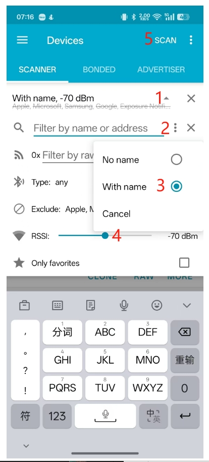
* 点击1后打开广播的筛选设置界面，在此界面下点击2，3可以筛选掉无蓝牙名字的广播设备，不设置过滤的话环境中有可能会有几十上百个设备，会使我们不方便分辨设备，智能戒指一定是有蓝牙名字的，所以我们选择“With name”。
* 点击3的滑点可以筛选RSSI。RSSI是信号强度，常规情况下为负值，值越大信号值越大，一般情况下戒指在贴近手机外壳的情况下大于-60dBm。所以我们可以将小于这个信号值的筛选掉不显示。
* 接下来就可以点击空白位置关闭掉筛选设置界面，点击5进行发现设备了。比较容易忽略的点是5位置的"SCAN"在蓝牙扫描状态下字体会变成"STOP SCANNING",当显示"SCAN"时候代表未执行扫描动作或者是扫描结束。
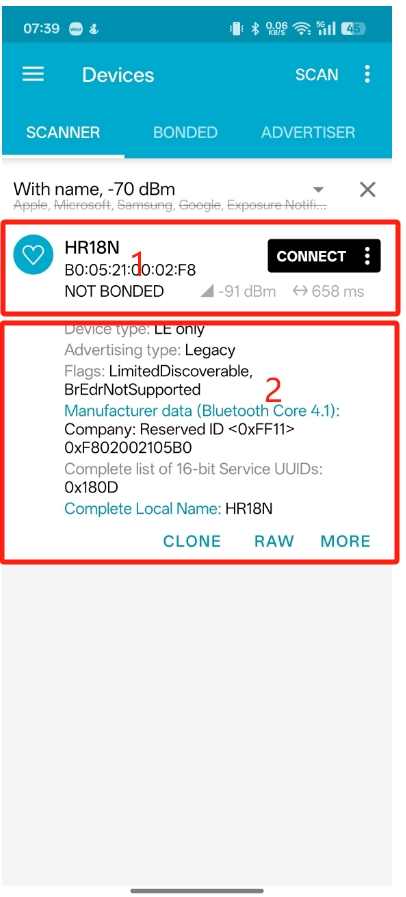
* 在上图中，将戒指放在手机旁边发现设备后在1的界面内，显示了蓝牙名称和MAC地址。点击1会展开，在2的界面内显示了一个详细的广播数据，其中最需要我们关注的就是Manufacturer data，此数据是自定义数据，尤其是0xFF11位置代表了，我们的设备所支持的协议版本，具体的应用方法以后会介绍到。目前我们就完成了戒指的广播测试。
* 如果您使用此方法扫描不到设备，请注意以下几点：
1.打开APP的蓝牙和定位权限。
2.确认戒指有电，可以一直放在充电座上测试。
3.确认戒指没有被其他手机连接，当智能戒指的蓝牙被连接后，广播会停止发送。
4.确认戒指没有被自己手机的APP后台，杀掉手机的后台程序，重新扫描。
#### 1.2.连接状态
* 在连接状态下，可以进行戒指的应用协议测试。例如读取固件版本号，硬件版本号等。
#### 1.3.关机状态
* 在关机状态下，戒指的蓝牙广播关闭，在这个状态下戒指进入了低功耗状态，如果想恢复广播状态需要充电唤醒。
* 但是如果冲电中超过半小时，确认这个戒指没有被其他手机连接且手机权限正常依然发现不了广播的话，戒指可能存在故障，请联系渠道商更换测试戒指。
### 2.智能戒指的方案设计
本小节用不同的视角对智能戒指的设计进行分析，以让开发者更直观的理解设计思路。
#### 2.1.功能和接口框架
##### 2.1.1.戒指功能框架

* 充电模块：可以获取到戒指的充电状态和电量。  
* 时钟模块：保持时钟的运行。  
* 内存空间：存储用户个性化配置和健康测量产生的数据记录。  
* 运动模块：提供计步，运动功能的支持。  
* 健康模块：戒指在佩戴中会自动触发健康测量，每次测量会存储一条数据记录在戒指内的存储空间。  
戒指在蓝牙连接中，可以由APP触发健康测量，在健康测量的过程中，戒指会实时返回当前的测量结果和进度。测试完成后也会在存储空间内增加一条数据记录。  
* 选配功能：待补充。
##### 2.1.2.API功能框架
  
#### 2.2.蓝牙通讯事件
按照智能穿戴硬件产品和APP之间的从属关系，此SDK把重要的关键操作事件进行了组合，组成了五种事件：绑定，连接，刷新，断连回调，解绑。使通讯效率有效提高。
##### 2.2.1.设备绑定
* 触发条件：1.在用户第一次注册后绑定设备 或者 2.用户解绑过设备，当前账户下没有绑定的设备。
* 执行操作：蓝牙扫描，设备过滤，设备连接，发送“绑定事件”请求，等待接收“绑定事件”应答。
* 说明：戒指收到绑定事件后，会自动将戒指恢复出厂设置，清空出厂时候测试的数据记录，设置当前时间时区，清空步数等。
* 安卓相关API：
  ```java
  LmAPI.APP_BIND()
  ```
* IOS相关API：
  ```Swift
  /// APP事件-绑定戒指
  /// - Parameters:
  ///   - date: 当前时间
  ///   - timeZone: 时区
  /// - Parameter completion: 绑定戒指回调
  BCLRingManager.shared.appEventBindRing(date: Date, timeZone: BCLRingTimeZone, completion: @escaping (Result<BCLBindRingResponse, BCLError>) -> Void)
  ```
##### 2.2.2.设备连接
* 触发条件：在账户已经绑定过戒指的情况下打开APP。
* 执行操作：设备连接，发送“连接事件”请求，等待接受“连接事件”应答。
* 说明：获取设备在未连接状态下产生的数据记录，同步事件，软硬件版本号，当前步数，电量，功能配置。
* 安卓相关API：
  ```java
  LmAPI.APP_CONNECT()
  ```
* IOS相关API：
    ```Swift
    /// APP事件-连接戒指
    /// - Parameters:
    ///   - date: 当前时间
    ///   - timeZone: 时区
    ///   - callbacks: 回调集合
    /// - Parameter completion: 连接戒指回调
    BCLRingManager.shared.appEventConnectRing(date: Date, timeZone: BCLRingTimeZone, callbacks: BCLDataSyncCallbacks, completion: @escaping (Result<BCLConnectRingResponse, BCLError>) -> Void)
    ```
##### 2.2.3.设备刷新
* 触发条件：在APP打开的情况下，APP下拉刷新
* 执行操作：发送“刷新事件”请求，等待接收“刷新事件”应答。
* 说明：获取设备在未连接状态下产生的数据记录，同步事件，软硬件版本号，当前步数，电量，功能配置。此指令和设备连接指令类似。
* 安卓相关API：
   ```java
  BLEUtils.connectLockByBLE
  ```
* IOS相关API：
  ```Swift
    /// APP事件-刷新戒指
    /// - Parameters:
    ///   - date: 当前时间
    ///   - timeZone: 时区
    ///   - callbacks: 回调集合
    /// - Parameter completion: 刷新戒指回调
    BCLRingManager.shared.appEventRefreshRing(date: Date, timeZone: BCLRingTimeZone, callbacks: BCLDataSyncCallbacks, completion: @escaping (Result<BCLRefreshRingResponse, BCLError>) -> Void)
  ```
##### 2.2.4.设备断连重连
* 触发条件：在APP打开或者APP在后台的情况下，发生了蓝牙的断开。**戒指充电的时候蓝牙一定会断开。**
* 执行操作：设备连接，发送“连接事件”请求，等待接收“连接事件”应答。
* 说明：由于戒指的体积，结构，材料限制，射频性能不如蓝牙耳机好，重连机制是必要的，可以增加稳定性。
* 安卓相关API：
  ```java
  BLEUtils.connectLockByBLE
  ```
* IOS相关API：
  ```Swift
    /// 当蓝牙断开时，是否自动重连（默认为false,不自动重连）
    BCLRingManager.shared.isAutoReconnectEnabled = true
  ```
##### 2.2.5.设备解绑
* 触发条件：用户手动解绑。
* 执行操作：如果蓝牙连接中，则发送“解绑事件”请求，等待“解绑事情”应答。
* 说明：此指令不是必要的，在“解绑事件”请求发出后，戒指会主动关闭健康模块，进入低功耗模式。
* 安卓相关API：
  ```java
  BLEUtils.disconnectBLE
  ```
* IOS相关API：
##### 2.2.6.绑定配对
智能戒指的蓝牙连接分为两种情况：
1.不具有绑定配对功能，在这种情况下的连接在手机设置里面是看不到蓝牙设备的，杀掉APP的程序后，蓝牙会断开。
2.具有绑定配对功能，在这种情况下的连接在手机设置里面能看到蓝牙设备，杀掉APP后蓝牙和手机不会断开（具有手势，触摸，语音功能的戒指一定支持HID功能）。
|功能点|具有绑定配对|不具有绑定配对|
|-|-|-|
|绑定事件|扫描到设备后，需调用绑定配对连接，连接后系统蓝牙下可看到绑定的设备|扫描后连接|
|连接事件|直接获取系统蓝牙下的设备句柄通讯|直接连接或者扫描后连接|
|刷新事件|直接通讯|直接通讯|
|断链事件|发生断链后，手机系统会自动恢复蓝牙连接|需要程序执行断链回调事件|
|解绑事件|解绑时需要解除系统蓝牙的绑定，IOS不能自动解绑需要UI提示解绑|蓝牙直接断开|
#### 2.3.健康统计图设计
在实现了上一章通讯事件的设计之后，就会知道在每次“设备连接”和“设备刷新”的应答中戒指会反馈数据记录，数据记录包含了时间戳，心率，血氧，计步，情绪指数等信息，APP拿到这些数据记录之后存储到自己的云端或者本地数据库，获取数据结束后，利用这些数据进行数据统计分析或者给用户健康建议。
由于数据记录的格式是固定的，当进行心率测量的时候存储的数据记录血氧值是无效的，当进行血氧测量的时候存储的数据记录心率变异性值是无效的，所以进行数据绘制折线的时候，需要对无效值进行过滤。
##### 2.3.1.心率图的设计
更新条件：连接事件，刷新事件
数据来源：数据库，筛选掉心率值为0的记录。
心率折线图的Y轴的最大最小值：250，30，单位bpm
##### 2.3.2.血氧图的绘制
更新条件：连接事件，刷新事件
数据来源：数据库，筛选掉血氧值为0的记录。
血氧柱形图的Y轴的最大最小值：50，100，单位%
##### 2.3.3.体表温度图的绘制
更新条件：连接事件，刷新事件
数据来源：数据库，筛选掉温度值为0的记录。
温度折线图的Y轴的最大最小值：34.00，42.00，单位℃
##### 2.3.4.睡眠图的绘制
更新条件：连接事件，刷新事件
数据来源：数据库，筛选掉睡眠状态为0的记录，1：清醒，2：浅睡，3：深睡，4：眼动期
调用算法API获取入睡时间，唤醒时间和分期表。
* 安卓相关API：
  ```java
    LogicalApi.calculateSleep();
  ```
* IOS相关API：
#### 2.4.其他常规功能设计
本小节的功能需要蓝牙连接状态才能够正常使用。
##### 2.4.1.主动心率测量
触发主动测量有三个可选项配置：是否上传rawdata，是否上传测量进度，是否上传RR间期结果。开发者可以根据自己的算法需求进行配置。
* 安卓相关API：
  ```java
  LmAPI.GET_HEART_ROTA
  ```
* IOS相关API：
  ```Swift
  /// 心率测量
  /// - Parameters:
  ///   - collectTime: 采集时间(单位：秒)
  ///   - collectFrequency: 采集频率(单位：次/秒)
  ///   - waveformConfig: 波形配置(0:不上传 1:上传)
  ///   - progressConfig: 进度配置(0:不上传 1:上传)
  ///   - intervalConfig: 间期配置(0:不上传 1:上传)
  /// - Result: 测量结果
  /// - BCLHeartRateResponse: 包含测量结果的响应模型
  /// - BCLError: 错误信息
  BCLRingManager.shared.startHeartRate(collectTime: Int, collectFrequency: Int, waveformConfig: Int, progressConfig: Int, intervalConfig: Int, completion: @escaping (Result<BCLHeartRateResponse, BCLError>) -> Void)
  ```
##### 2.4.2.主动血氧测量
触发主动测量有三个可选项配置：是否上传rawdata，是否上传测量进度。开发者可以根据自己的算法需求进行配置。
* 安卓相关API：
  ```java
  LmAPI.GET_HEART_ROTA
  LmAPI.STOP_HEART()
  ```
* IOS相关API：
  ```Swift
  /// 血氧测量
  /// - Parameters:
  ///   - collectTime: 采集时间(单位：秒)
  ///   - collectFrequency: 采集频率(单位：次/秒)
  ///   - waveformConfig: 波形配置(0:不上传 1:上传)
  ///   - progressConfig: 进度配置(0:不上传 1:上传)
  /// - Result: 测量结果
  /// - BCLBloodOxygenResponse: 包含测量结果的响应模型
  /// - BCLError: 错误信息
  BCLRingManager.shared.startBloodOxygen(collectTime: Int, collectFrequency: Int, waveformConfig: Int, progressConfig: Int, completion: @escaping (Result<BCLBloodOxygenResponse, BCLError>) -> Void)
  ```
##### 2.4.3.主动心电图测量
心电图测量的UI界面设计是复杂的，我们开发了绘图方法，在./sourece/文件夹下。
* 安卓相关API：
   ```java
  LmAPI.STAR_ELEC()//开启心电测量
  LmAPI.STOP_ELECTROCARDIOGRAM();//结束心电测量
  ```
* IOS相关API：
##### 2.4.4.触摸手势设置
触摸手势的设置不是一直保持的，当戒指充电或者低电量关机后再次开机的时候，功能是默认关闭的。
* 安卓相关API：
    ```java
  LmAPI.GET_HID_CODE//获取HID功能码
  LmAPI.SET_HID;//设置戒指的HID模式
  LmAPI.GET_HID;//获取HID模式
  ```
* IOS相关API：
##### 2.4.5.实时语音传输
有两种传输模式：
1.APP下发实时语音的开始和停止。
2.触摸控制实时语音的采集和推送。
* 安卓相关API：
  ```java
  LmAPI.GET_HID_CODE//获取HID功能码
  LmAPI.SET_HID;//设置戒指的HID模式
  LmAPI.GET_HID;//获取HID模式
  ```
* IOS相关API：
##### 2.4.6.血压测量
* 安卓相关API：
  ```java
  LmAPI.BLOOD_PRESSURE_APP//开始测量血压
  LmAPI.STOP_BLOOD_PRESSURE_APP;//停止血压测量
  ```
* IOS相关API：
##### 2.4.7.震动闹钟设置
可以按照闹钟的方式设置戒指震动，最多设置5个闹钟
* 安卓相关API：
  ```java
  LmAPI.ALARM_CLOCK_SETTING//闹钟设置
  LmAPI.GET_ALARM_CLOCK;//读取闹钟设置
  ```
* IOS相关API：
##### 2.4.8.OTA无线升级
本SDK封装了OTA文件服务器的网络接口和OTA蓝牙协议。
* 安卓相关API：
  ```java
  LogicalApi.createToken //申请token
  OtaApi.otaUpdateWithCheckVersion//ota升级
  ```
* IOS相关API：
##### 2.4.9.个性化设置
###### 2.4.9.1蓝牙名字
* 安卓相关API：
  ```java
  LmAPI.Set_BlueTooth_Name//设置蓝牙名称
  LmAPI.Get_BlueTooth_Name//获取蓝牙名称
  ```
* IOS相关API：
  ```Swift
  /// 设置蓝牙名称
  /// - Parameter name: 蓝牙名称
  /// - Parameter completion: 设置蓝牙名称回调
  /// - Result: 设置结果
  /// - BCLSetBluetoothNameResponse: 包含设置结果的响应模型
  /// - BCLError: 错误信息
  BCLRingManager.shared.setBluetoothName(name: String, completion: @escaping (Result<BCLSetBluetoothNameResponse, BCLError>) -> Void)

  /// 获取蓝牙名称
  /// - Parameter completion: 获取蓝牙名称回调
  /// - Result: 获取结果
  /// - BCLReadBluetoothNameResponse: 包含获取结果的响应模型
  /// - BCLError: 错误信息
  BCLRingManager.shared.getBluetoothName(completion: @escaping (Result<BCLReadBluetoothNameResponse, BCLError>) -> Void)
  ```
###### 2.4.9.2测量间隔
* 安卓相关API：
  ```java
  LmAPI.SET_COLLECTION//设置
  LmAPI.GET_COLLECTION//读取
  ```
* IOS相关API：
  ```Swift
  /// 设置采集周期
  /// - Parameter period: 采集周期（单位：秒）最小值为60
  /// - Parameter completion: 设置采集周期回调
  /// - Result: 设置结果
  /// - BCLSetCollectPeriodResponse: 包含设置结果的响应模型
  /// - BCLError: 错误信息
  BCLRingManager.shared.setCollectPeriod(period: Int, completion: @escaping (Result<BCLSetCollectPeriodResponse, BCLError>) -> Void)

  /// 获取采集周期
  /// - Parameter completion: 获取采集周期回调
  /// - Result: 获取结果
  /// - BCLGetCollectPeriodResponse: 包含采集周期的响应模型
  /// - BCLError: 错误信息
  BCLRingManager.shared.getCollectPeriod(completion: @escaping (Result<BCLGetCollectPeriodResponse, BCLError>) -> Void)
  
  ```

  ###### 2.4.9.3用户信息
* 安卓相关API：
  ```java
      /**
     *  设置个人信息
     * @param sex 性别，0女，1男
     * @param height 身高，单位1cm
     * @param weight 体重，单位0.1kg
     * @param age 年龄，单位月
     */
  LmAPI.SET_USER_INFO(int sex,int height,int weight,int age) //设置用户信息
  
  LmAPI.GET_USER_INFO//获取个人信息
  ```
* IOS相关API：
 
### 3.智能戒指SDK移植
#### 3.1.环境要求
##### 安卓：
* SDK库格式：aar
* 开发语言：JAVA
* Android系统版本：6.0以上
* 蓝牙版本：5.0以上
##### IOS：
* IOS系统版本：13.0以上
* 语言版本：Swift 5.0以上
* IDE版本：xcode 16以上
* 蓝牙版本：5.0以上
#### 3.2.库文件添加
##### 安卓：
1.将./Android/library/aar文件，放在libs目录下。
2.目前只提供离线sdk，所以需要用户手动添加一些依赖，后期会做优化，版本号可以使用自己工程里的
```java
implementation 'androidx.appcompat:appcompat:1.3.1'
implementation 'org.greenrobot:greendao:3.3.0'
implementation 'androidx.localbroadcastmanager:localbroadcastmanager:1.1.0'
implementation 'org.ligboy.retrofit2:converter-fastjson-android:2.1.0'
implementation 'com.squareup.retrofit2:adapter-rxjava:2.3.0'
implementation 'org.jetbrains:annotations:15.0'
implementation  'com.google.code.gson:gson:2.11.0'
implementation 'com.zhy:okhttputils:2.6.2'
```
##### IOS：
1、手动集成：将./IOS/library/iOS_New_Framework/BCLRingSDK.framework文件夹拖入到Xcode的项目中，选择“Copy items if needed”选项。

2、Cocoapods集成：待支持

3、Swift Package Manager集成：待支持
#### 3.3.权限设置
##### 安卓：
配置所需权限（在程序中也需要动态检测权限），在Manifest.xml中加入以下代码:
```xml
<uses-permission android:name="android.permission.BLUETOOTH_ADVERTISE" />
<uses-permission android:name="android.permission.BLUETOOTH_CONNECT" />
<uses-permission android:name="android.permission.BLUETOOTH_SCAN" />
<uses-permission android:name="android.permission.ACCESS_COARSE_LOCATION" />
<uses-permission android:name="android.permission.ACCESS_FINE_LOCATION" />
```
##### IOS：
```xml
# Info.plist 增加蓝牙权限
Privacy - Bluetooth Peripheral Usage Description
Privacy - Bluetooth Always Usage Description
```
#### 3.4.SDK使用
##### 安卓：
1.在Application的onCreate方法中进行初始化
```java
LmAPI.init(this);
LmAPI.setDebug(true);
//如使用简化版本，需要初始化LmAPILite
LmAPILite.init(this);
LmAPILite.setDebug(true);
```
2.在BaseActivity类中启用监听，该监听用于监听蓝牙连接状态和戒指的应答
**注：若重复调用监听LmAPI.addWLSCmdListener(this, this)会出现重复现象**
```java
LmAPI.addWLSCmdListener(this, this);
```
##### IOS：

### 3、库的使用
#### 3.1 蓝牙操作
此类是使用蓝牙搜索、连接、 断开的公共类 ，统一由IResponseListener接口反馈。 
##### 3.1.1 搜索设备
接口功能：开启蓝牙发现，发现周围的蓝牙设备并获取其广播的数据，解析广播数据判断是否符合智能戒指的广播格式，如果符合则从广播数据中获取配置信息。
接口声明：
```java
BLEUtils.startLeScan(Context context, BluetoothAdapter.LeScanCallback leScanCallback);
```
参数说明：context：上下文     leScanCallback：蓝牙搜索的回调  
返回值
```jave
（void onLeScan(BluetoothDevice device, int rssi, byte[] bytes)）
```
该接口的返回值说明如下：
```java
private BluetoothAdapter.LeScanCallback leScanCallback = new BluetoothAdapter.LeScanCallback() {
    @Override
    public void onLeScan(BluetoothDevice device, int rssi, byte[] bytes) {
        //处理搜索到的设备
    }
};
```
注意事项：在开发者调试时候，发现不到设备的情况下，可用公版APP进行绑定对比测试，一般情况下，戒指正常的话，手机靠近戒指，RSSI的值大于-60。
##### 3.1.2 停止搜索
接口功能：蓝牙连接以后，可以关闭蓝牙搜索功能。  
接口声明：
```java
BLEUtils.stopLeScan(Context context, BluetoothAdapter.LeScanCallback leScanCallback);
```
参数说明：context：上下文    leScanCallback：蓝牙搜索的回调  
返回值：无

##### 3.1.3 连接设备

接口功能：发起连接蓝牙设备。
接口声明：
```java
BLEUtils.connectLockByBLE(Context context, BluetoothDevice bluetoothDevice);
```
参数说明：context：上下文  
bluetoothDevice ：蓝牙设备  
返回值：
```java
@Override
public void lmBleConnecting(int code) {
    //正在连接
}
@Override
public void lmBleConnectionSucceeded(int code) {
    //连接成功
}
@Override
public void lmBleConnectionFailed(int code) {
    //连接失败
}
//断连后或者设备故障，发送指令超时，cmd是超时的指令
 @Override
    public void timeOut(String cmd) {

    }
```
为了保证断连后重连，需要在以上回调里，设置一些属性
```java
@Override
public void lmBleConnecting(int code) {
    //正在连接
  BLEUtils.setConnecting(true);//连接中，防止重复连接
}
@Override
public void lmBleConnectionSucceeded(int code) {
    //连接成功
   BLEUtils.setConnecting(false);
BLEUtils.setGetToken(true);
}
@Override
public void lmBleConnectionFailed(int code) {
    //连接失败
  BLEUtils.setGetToken(false);//连接失败
  BLEUtils.setConnecting(false);
}
```
BLEUtils.setConnecting//蓝牙是否在连接中，防止重复连接
BLEUtils.setGetToken//是否已连接到蓝牙，这个按自己项目需求调用，公版app是在连接过后，指令走完，才算连接成功


##### 3.1.4 断开蓝牙
接口功能：断开设备。  
接口声明：

```java
BLEUtils.disconnectBLE(Context context);
```
参数说明：context：上下文  
返回值：无
##### 3.1.5 蓝牙重连
接口功能：在戒指连接断开时，重连设备，重连比连接速度要快
接口声明：
```java
        BluetoothDevice remote  = BluetoothAdapter.getDefaultAdapter().getRemoteDevice(mac);
                if(remote != null){
                    BLEUtils.connectLockByBLE(this,remote);
                }
```
参数说明：mac：戒指mac地址   
返回值：无  
公版app重连逻辑，如果蓝牙断开，延时重连，可以参考
```java
    private List<BluetoothDevice> dataEntityList = new ArrayList<>();

 @Override
    public void lmBleConnectionFailed(int i) {
        BLEUtils.setGetToken(false);
        postView("\n连接失败 ");

            Log.e("ConnectDevice", " 蓝牙 connectionFailed");

            handler.removeMessages(101);
            handler.sendEmptyMessageDelayed(101, 3000);

        }

  Handler handler = new Handler(new Handler.Callback() {
        @Override
        public boolean handleMessage(@NonNull Message msg) {

            if (msg.what == 101) {

                    String mac = UtilSharedPreference.getStringValue(TestActivity.this, "address");
                    if (!TextUtils.isEmpty(mac) && !BLEUtils.isGetToken()) {
                        Log.e("TAG", "Handler  延迟重连  resetConnect 1111 ");
                        BLEUtils.setConnecting(false);
                        connect(mac);
                    }

            }
            return false;
        }
    });


  private void connect(String mac) {
        dataEntityList.clear();
        Logger.show(TAG, "connect=" + mac, 6);
        this.mac = mac;
        //合并
        checkPermission();

    }

    public void checkPermission() {

        if(App.isBackground){//app在后台不需要重连
            return;
        }
        String[] permission;
        if (Build.VERSION.SDK_INT >= Build.VERSION_CODES.S) {
            permission = new String[]{Permission.ACCESS_FINE_LOCATION, Permission.BLUETOOTH_CONNECT, Permission.BLUETOOTH_SCAN};
        } else {
            permission = new String[]{Permission.READ_MEDIA_IMAGES, Permission.READ_MEDIA_VIDEO, Permission.READ_MEDIA_AUDIO, Permission.WRITE_EXTERNAL_STORAGE, Permission.ACCESS_FINE_LOCATION};
        }
        if (getSupportActivity().isFinishing()) {
        return;
        }
        XXPermissions.with(this).permission(permission)
                .request(new OnPermissionCallback() {
                    @Override
                    public void onGranted(@NonNull List<String> permissions, boolean allGranted) {
                        if (!allGranted) {
                            ((MainActivity) getSupportActivity()).showTipsDialog();
                            return;
                        }
                        connecting=false;
                        handler.removeMessages(0);
                        handler.sendEmptyMessageDelayed(0, timeOut);
                        refreshLayout.setRefreshing(true);
                        Logger.show("ConnectDevice", "mac :" + mac);
                        if(StringUtils.isEmpty(mac)){
                            mac = PreferencesUtils.getString("address");
                        }
                        BluetoothDevice remote = BluetoothAdapter.getDefaultAdapter().getRemoteDevice(mac);
//                        remote=null;
                        if (BLEService.isGetToken()) {
                            Logger.show("ConnectDevice", " 蓝牙已连接");

                            String status = getRsString(R.string.connecting);

                            if (((MainActivity) getSupportActivity()) != null) {
                                ((MainActivity) getSupportActivity()).aboutFragmentSetConnectStatus(status);
                            }
                            refreshLayout.setRefreshing(false);
                        } else if (remote != null && (mac).equalsIgnoreCase(remote.getAddress())) {
                            App.getInstance().setDeviceBean(new BleDeviceInfo(remote, -50));
                            Set<BluetoothDevice> bondedDevices = BluetoothAdapter.getDefaultAdapter().getBondedDevices();

                            if (App.getInstance().otaUpdate) {//如果是ota升级过了，直接走广播，获取新的配置
                                Logger.show("ConnectDevice", "ota升级过了，直接走广播，获取新的配置 ");
                                BLEUtils.stopLeScan(getSupportActivity(), leScanCallback);
                                BLEUtils.startLeScan(getSupportActivity(), leScanCallback);
                            } else {
                                //如果系统蓝牙已经有绑定的戒指，直接连接
                                if (bondedDevices.contains(remote)) {
                                    Logger.show("ConnectDevice", "系统蓝牙已经有绑定的戒指，直接连接 ");
                                    directConnection(remote);
                                } else {//如果没有，就进入扫描
                                    //是定时器关闭的蓝牙，从后台到前台进行重连，直接直连
                                    if (App.getInstance().disconnectByTimer) {
                                        Logger.show("ConnectDevice", "定时器关闭的蓝牙，从后台到前台进行重连，直接直连 ");
                                        directConnection(remote);

                                        App.getInstance().disconnectByTimer = false;
                                    } else {

                                            UserInfo userInfo = App.getInstance().getUserInfo();
                                            if (userInfo != null && getSupportActivity() != null) {
                                                if (!"1".equals(userInfo.getBindingIndicatorBit()+"") && !connecting) {
                                                    directConnection(remote);
                                                    Logger.show("不是HID的戒指", "直接连接");
                                                    return;
                                                }
                                            }
//                                        handler.removeMessages(101);
//                                        handler.sendEmptyMessageDelayed(101, 5000);
                                        Logger.show("ConnectDevice", " 蓝牙 startLeScan 连接   ");
                                        BLEUtils.stopLeScan(getSupportActivity(), leScanCallback);
                                        BLEUtils.startLeScan(getSupportActivity(), leScanCallback);
                                    }

                                }
                            }

                        } else {
                            Logger.show("ConnectDevice", " 蓝牙1 startLeScan 连接   ");
                            BLEUtils.stopLeScan(getSupportActivity(), leScanCallback);
                            BLEUtils.startLeScan(getSupportActivity(), leScanCallback);
                        }

                    }
                });
    }

    private void directConnection(BluetoothDevice remote){
        refreshLayout.setRefreshing(false);
        BLEUtils.stopLeScan(getSupportActivity(), leScanCallback);
        BLEUtils.connectLockByBLE(getSupportActivity(), remote);
        connecting = true;
    }
    boolean connecting = false;
    boolean isReUpData;
    @SuppressLint("MissingPermission")
    private BluetoothAdapter.LeScanCallback leScanCallback = new BluetoothAdapter.LeScanCallback() {
        @Override
        public void onLeScan(BluetoothDevice device, int rssi, byte[] bytes) {
            if (device == null || StringUtils.isEmpty(device.getName())||connecting) {//有戒指正在连接，不能再进行扫描，防止连接到另外的戒指

                return;
            }
            isReUpData = false;
            if (device.getName().contains("PPlusOTA")) {
                isReUpData = true;
                BLEUtils.stopLeScan(getSupportActivity(), leScanCallback);
                BLEUtils.connectLockByBLE(getSupportActivity(), device);
                App.getInstance().setDeviceBean(new BleDeviceInfo(device, rssi));
            }
           // Logger.show("ConnectDevice", "onLeScan");
            if (!App.getInstance().otaUpdate) {//如果不是ota升级进行的连接
                //扫描过程中，如果已经获取到用户信息，从云端拉取用户设备信息，如果是HID模式，继续走扫描，防止出现用户在系统蓝牙内解绑设备，直连导致无法配对，如果不是，直接连接
                UserInfo userInfo = App.getInstance().getUserInfo();
                if (userInfo != null && getSupportActivity() != null) {
                    if (!"1".equals(userInfo.getBindingIndicatorBit()+"") && !connecting) {
                        BluetoothDevice remote = BluetoothAdapter.getDefaultAdapter().getRemoteDevice(mac);
                        directConnection(remote);
                        Logger.show("connecting", "connecting");
                        return;
                    }
                }
            }
            if ((mac).equalsIgnoreCase(device.getAddress()) &&!BLEService.isGetToken()) {

                if (dataEntityList.contains(device)) {
                    return;
                }

                try {
                    if (getSupportActivity() == null) {
                        Log.i("getSupportActivity","null");
                        return;
                    }
                    //是否符合条件，符合条件，会返回戒指设备信息
                    BleDeviceInfo bleDeviceInfo = LogicalApi.getBleDeviceInfoWhenBleScan(device, rssi, bytes,false);
                    if (bleDeviceInfo == null) {
                        Log.i("bleDeviceInfo","null");
                        return;
                    }

                    App.getInstance().setDeviceBean(bleDeviceInfo);
                    connectDevice(bleDeviceInfo,device);
                    connecting = true;
                    dataEntityList.add(device);
                    Logger.show("ConnectDevice", "device:"+device.getAddress());
                    BLEUtils.stopLeScan(getSupportActivity(), leScanCallback);
                    BLEUtils.connectLockByBLE(getSupportActivity(), device);
                    App.getInstance().otaUpdate = false;
                } catch (Exception e) {
                    e.printStackTrace();
                }
            }
        }
    };


```
##### 3.1.6 前台服务
目前蓝牙连接服务是后台的，存在息屏状态下，或者app进入后台，蓝牙断连的问题，好处就是功耗低。如果需要将服务做成前台服务，可以在Application的onCreate()里设置
```java
       BLEUtils.contentTitle = "自己想要展示在app前台服务里的内容"
```
这个需要自己在合适的时机，比如app退到后台时，5分钟后，调用

```java
BLEUtils.disconnectBLE(Context context);
```
断开连接，否则蓝牙一直连接，功耗很大，电量消耗很快
可以通过设置BLEUtils.pendingIntent，可以响应前台服务通知点击事件，如果app在后台，点击前台服务，跳转到指定页面（ChipletRing1.0.64新增）
例如：
```java
        // 创建返回首页的Intent
        Intent notificationIntent = new Intent(this, MainActivity.class);
        notificationIntent.addFlags(Intent.FLAG_ACTIVITY_NEW_TASK | Intent.FLAG_ACTIVITY_CLEAR_TOP);
        notificationIntent.setAction(Long.toString(System.currentTimeMillis())); // 确保每次都是唯一的

        PendingIntent pendingIntent = PendingIntent.getActivity(
                this,
                0,
                notificationIntent,
                PendingIntent.FLAG_UPDATE_CURRENT | PendingIntent.FLAG_IMMUTABLE
        );
        BLEUtils.pendingIntent=pendingIntent;
```
```java
 <activity
            android:name=".activity.MainActivity"
            android:configChanges="fontScale|keyboard|keyboardHidden|locale|orientation|screenLayout|uiMode|screenSize|navigation" />
```
##### 3.1.6 解除绑定
 注意 换绑戒指时，建议将之前戒指解除绑定，调用指令，清理掉历史数据，否则有可能出现A戴过的戒指，B去戴，造成B的数据里有A的数据，或者一个人戴多个戒指睡眠，最后睡眠数据重叠的情况
```java
 //断开连接
  BLEUtils.disconnectBLE(getSupportActivity());
//解除系统蓝牙绑定，防止下次搜索不到戒指
  BLEUtils.removeBond(BLEService.getmBluetoothDevice());
```
#### 3.2 通讯协议
此类是使用戒指功能的公共类，戒指的功能通过该类直接调用即可,数据反馈除了特殊说明外 统一由IResponseListener接口反馈。(1.0.35版本后新增简化版本，入参和返回都做了封装，不再使用byte类型，通过LmAPILite调用，并且将指令返回接口按照功能分成多个小接口，职责更清晰，回调更少，之前监听LmAPI的地方换成LmAPILite即可)
调用此类的接口 ，需保证与戒指处于连接状态，戒指连接以后，要延时3s左右再发送指令，每个指令都需要有几百ms的间隔，防止指令冲突，导致没有回应  
##### 3.2.0 广播解析
sdk封装根据蓝牙扫描广播，获取是否符合条件的戒指，并返回该戒指的设备信息的方法LogicalApi.getBleDeviceInfoWhenBleScan，设备信息包括是否HID戒指(hidDevice:1是0非，兼容老版本戒指)，是否支持二代协议(communicationProtocolVersion:1不支持2支持)，是否支持绑定(bindingIndicatorBit,0不支持绑定、配对(仅软连接) 1绑定和配对 2仅支持配对)，充电指示位(chargingIndicator,1代表未充电 2代表充电中)
```java
BLEUtils.startLeScan(this, leScanCallback);
 private BluetoothAdapter.LeScanCallback leScanCallback = new BluetoothAdapter.LeScanCallback() {
        @Override
        public void onLeScan(BluetoothDevice device, int rssi, byte[] bytes) {
            if (device == null || TextUtils.isEmpty(device.getName())) {
                return;
            }
            //是否符合条件，符合条件，会返回戒指设备信息，第四个参数是指定特定版本戒指，快康公司传递true，其他公司都是false
            BleDeviceInfo bleDeviceInfo = LogicalApi.getBleDeviceInfoWhenBleScan(device, rssi, bytes,false);
           
        }
    };
```
设置BLEUtils.isHIDDevice=deviceBean.getBindingIndicatorBit()==1;如果是HID模式的戒指，可以走强连接模式连接蓝牙，保证稳定性  

重要: HID的戒指连接，需要将AndroidManifest.xml里的activity添加一个属性，因为会修改手机配置，如果不加，会导致重启或者连接多次的问题：
```java
 android:configChanges="fontScale|keyboard|keyboardHidden|locale|orientation|screenLayout|uiMode|screenSize|navigation"
```
##### 3.2.1 同步时间
接口功能：调用此接口会获取手机当前时间同步给戒指。  
接口声明：
```java
LmAPI.SYNC_TIME();
//同步时间可以设置时区， 东区为正，西区为负，比如东八区0x08，西八区为0xF8
LmAPI.SYNC_TIME_ZONE();
```
注意事项：同步时间和读取时间共用一个返回值。 
参数说明：无  
返回值
```java
（void syncTime(byte datum,byte[] time)）
```
| 参数名称 | 类型   | 示例值 | 说明                        |
| -------- | ------ | ------ | --------------------------- |
| datum    | byte   | 0或1   | 0代表同步成功 1代表读取时间 |
| time     | byte[] | null   | 同步时间不会返回byte[]      |

简化版本
```java
public static void SYNC_TIME(ISyncTimeListenerLite listenerLite)

public interface ISyncTimeListenerLite {

    void syncTime(boolean updateTime,long timeStamp);
}
```

##### 3.2.2 读取时间
接口功能：调用此接口会获取戒指当前时间。一般情况下用不到。
接口声明：  
注意事项：同步时间和读取时间共用一个返回值。
参数说明：无
```java
LmAPI.READ_TIME();
```
返回值
```java
（void syncTime(byte datum,byte[] time)）
```
| 参数名称 | 类型   | 示例值                                              | 说明                                                   |
| -------- | ------ | --------------------------------------------------- | ------------------------------------------------------ |
| datum    | byte   | 0或1                                                | 0代表同步成功 1代表读取时间                            |
| time     | byte[] | [48, -23, -1, 83, -111, 1, 0, 0, 8] = 1723691166000 | 读取时间成功，需转化为时间戳(小端模式，最后一位为时区) |

简化版本
```java
 public static void READ_TIME(ISyncTimeListenerLite listenerLite) 

public interface ISyncTimeListenerLite {

    void syncTime(boolean updateTime,long timeStamp);
}
```

##### 3.2.3 版本信息
接口功能：版本信息 ，获取戒指的版本信息。  
接口声明：
```java
LmAPI.GET_VERSION((byte) 0x00);  //0x00获取软件版本，0x01获取硬件版本
```
参数说明：type：0x00获取软件版本 ，0x01获取硬件版本  
返回值
```java
（void VERSION(byte type, String version)）
```
| 参数名称 | 类型   | 示例值  | 说明                            |
| -------- | ------ | ------- | ------------------------------- |
| type     | byte   | 0或1    | 0代表软件版本号 1代表硬件版本号 |
| version  | String | 1.0.0.1 | 版本号                          |

简化版本
```java
public static void GET_VERSION(boolean softVersion,IVersionListenerLite listenerLite)

public interface IVersionListenerLite {
    void versionResult( String softwareVersion,String hardwareVersion);
}

```

##### 3.2.4 电池电量
接口功能：获取电池电量、 电池状态。  
接口声明：
```java
LmAPI.GET_BATTERY((byte) 0x00);  //0x00获取电量，0x01获取充电状态
```
参数说明：type：0x00获取电量 ，0x01获取充电状态  
返回值
```java
（void battery(byte status, byte datum)）
```
| 参数名称 | 类型 | 示例值 | 说明                        |
| -------- | ---- | ------ | --------------------------- |
| status   | byte | 0或1   | 0代表电池电量 1代表充电状态 |
| datum    | byte | 0-100  | 电量                        |
| datum    | byte | 1 | 0未充电 1充电中 2充满        |

简化版本
```java
//type 电池类型，0读取电量(充电中和充电完成，电量无效) 1充电状态，电量无效
static void GET_BATTERY(int type, IBatteryListenerLite listenerLite)

public interface IBatteryListenerLite {
  /**
     * 电量
     * @param type 获取电量还是获取充电状态 0是电量，1是充电状态
     * @param chargingStatus 充电状态描述
     * @param electricity 电量百分比
     */
    void battery(int type,String chargingStatus, int electricity);
}
```

##### 3.2.5 读取步数
接口功能：获取当天累计步数。  
接口声明：
```java
LmAPI.STEP_COUNTING（）
```
参数说明：无  
返回值
```java
（void stepCount(byte[] bytes)）
```
| 参数名称 | 类型   | 示例值 | 说明                                  |
| -------- | ------ | ------ | ------------------------------------- |
| bytes    | byte[] | 3303   | 步数819(小端模式，由0333转10进制得到) |

简化版本
```java
public static void STEP_COUNTING(IStepListenerLite listenerLite)

public interface IStepListenerLite {
    /**
     * 计步
     *
     * @param steps 步数
     */
    void stepCount(int steps);

    /**
     * 清除步数
     * @param
     */
    void clearStepCount();
}
```
##### 3.2.6 清除步数
接口功能：清除步数。  
接口声明：
```java
LmAPI.CLEAR_COUNTING（）
```
参数说明：无  
返回值：  
```java
（void clearStepCount(byte data)）
```
| 参数名称 | 类型   | 示例值 | 说明                                  |
| -------- | ------ | ------ | ------------------------------------- |
| byte    | data | 1   | 返回1代表清除步数成功 |

简化版本
```java
 public static void CLEAR_COUNTING(IStepListenerLite listenerLite)
 public interface IStepListenerLite {
    /**
     * 计步
     *
     * @param steps 步数
     */
    void stepCount(int steps);

    /**
     * 清除步数
     * @param
     */
    void clearStepCount();
}
```
##### 3.2.7 恢复出厂设置
接口功能：恢复出厂设置  
接口声明：
```java
LmAPI.RESET（）
```
参数说明：无  
返回值：无 ，有回调reset方法即认为成功
简化版本
```java
 public static void RESET(ISystemControlListenerLite listenerLite)

public interface ISystemControlListenerLite {
    /**
     * 恢复出厂设置
     */
    void reset();

    /**
     * 设置采集周期
     */
    void setCollection(boolean success);

    /**
     * 获取采集周期
     */
    void getCollection(int data);

    /**
     * 获取序列号
     * @param serial
     */
    void getSerialNum(String serial);

    /**
     * 设置序列号

     */
    void setSerialNum(boolean success);

    /**
     * 设置蓝牙名称
     */
    void setBlueToolName(boolean success);

    /**
     * 读取蓝牙名称
     * @param len 蓝牙名称长度
     * @param name 蓝牙名称
     */
    void readBlueToolName(int len,String name);
}
```
##### 3.2.8 采集周期设置
接口功能：采集周期设置  
接口声明：
```java
LmAPI.SET_COLLECTION（collection）//采集周期，单位秒
```
参数说明：colection：采集间隔，单位秒  
返回值：
```java
(void setCollection(byte result))
```

| 参数名称 | 类型   | 示例值   | 说明                        |
| -------- | ------ | -------- | --------------------------- |
| result   | byte   | 0，1     | 设置采集周期失败 1代表0代表设置采集周期成功 |

简化版本
```java
  public static void SET_COLLECTION(int parseInt,ISystemControlListenerLite listenerLite)
  public interface ISystemControlListenerLite {
    /**
     * 恢复出厂设置
     */
    void reset();

    /**
     * 设置采集周期
     */
    void setCollection(boolean success);

    /**
     * 获取采集周期
     */
    void getCollection(int data);

    /**
     * 获取序列号
     * @param serial
     */
    void getSerialNum(String serial);

    /**
     * 设置序列号

     */
    void setSerialNum(boolean success);

    /**
     * 设置蓝牙名称
     */
    void setBlueToolName(boolean success);

    /**
     * 读取蓝牙名称
     * @param len 蓝牙名称长度
     * @param name 蓝牙名称
     */
    void readBlueToolName(int len,String name);
}
```

##### 3.2.9 采集周期读取
接口功能：采集周期读取  
接口声明：

```java
LmAPI.GET_COLLECTION（）//采集周期，单位秒
```
参数说明：无  
返回值：
```java
(void getCollection(byte[] bytes))
```
| 参数名称 | 类型   | 示例值   | 说明                            |
| -------- | ------ | -------- | ------------------------------- |
| bytes    | byte[] | b0040000 | 采集时间间隔 ，单位秒 如：1200s |

简化版本
```java
   public static void GET_COLLECTION(ISystemControlListenerLite listenerLite)
   public interface ISystemControlListenerLite {
    /**
     * 恢复出厂设置
     */
    void reset();

    /**
     * 设置采集周期
     */
    void setCollection(boolean success);

    /**
     * 获取采集周期
     */
    void getCollection(int data);

    /**
     * 获取序列号
     * @param serial
     */
    void getSerialNum(String serial);

    /**
     * 设置序列号

     */
    void setSerialNum(boolean success);

    /**
     * 设置蓝牙名称
     */
    void setBlueToolName(boolean success);

    /**
     * 读取蓝牙名称
     * @param len 蓝牙名称长度
     * @param name 蓝牙名称
     */
    void readBlueToolName(int len,String name);
}
```

**注：无特殊标记的情况下，本SDK中返回的值皆为小端模式，demo中提供bytes转int的方法**
##### 3.2.10 测量心率
接口功能：测量心率。  
接口声明：
```java
LmAPI.GET_HEART_ROTA（byte waveForm, byte acqTime,IHeartListener iHeartListener）
```
参数说明：  
waveForm：是否配置波形 0不上传 1上传  
acqTime：采集时间 （byte）30s是正常时间,0为一直采集  
iHeartListener:  此接口是测量数据的监听  
返回值：

```java
 LmAPI.GET_HEART_ROTA((byte) 0x01, (byte)0x30, new IHeartListener() {
     @Override
     public void progress(int progress) {
         setMessage("正在测量心率..." + String.format("%02d%%", progress));
     }
     @Override
     public void resultData(int heart, int heartRota, int yaLi, int temp) {
                 //心率，心率变异性，压力，温度
     }
     @Override
     public void waveformData(byte seq, byte number, String waveData) {
                  //心率返回波形图数据分析：waveData
           }
     @Override
     public void rriData(byte seq, byte number, String data) {
         //心率测量中的RR间期值
     }
     @Override
     public void error(int value) {
         switch (value) {
             case 0:
                 ToastUtils.show("未佩戴");
                 break;
             case 2:
                 ToastUtils.show("充电中不允许采集");
                 break;
             case 4:
                 ToastUtils.show("繁忙，不执行");
                 break;
             default:
                 break;
         }
     }
     @Override
     public void success() {
     }
 });
```
简化版本
```java
   public static void GET_HEART_ROTA(int waveForm,int acqTime,IHeartListenerLite listenerLite)

   public interface IHeartListenerLite {
      void progress(int progress);
      void resultData(int heart,int heartRota,int yaLi,int temp);
      void waveformData(int serialNumber,int numberOfData,String waveData);
      void rriData(byte seq,byte number,String data);
      void error(int code,String message);
      void success();
      void stopHeart();
 }

主动测量以后，如果立刻从戒指读取未上传数据，有可能读取不到最新结果，因为戒指保存会有延迟，用户可以延时几秒获取，或者把测量数据保存到本地数据库，本地数据库已做去重操作，不用担心后续未上传数据上传以后，有重复数据的情况
以下是样例：
```java
  HistoryDataBean entity = new HistoryDataBean();
                entity.setMac(BLEUtils.mac);
                entity.setTime(System.currentTimeMillis() / 1000);
                entity.setHeartRate(heart);
                entity.setHeartRateVariability(heartRota);
                entity.setStressIndex(yaLi);
                entity.setTemperature(temp);
                entity.setSleepType(0);
                DataApi.instance.insertBatch(entity);

```

```
##### 3.2.11 测量血氧
接口功能：测量血氧。  
接口声明：
```java
LmAPI.GET_HEART_Q2（byte waveForm,IQ2Listener iQ2Listener）
```
参数说明：  
waveForm：是否配置波形 0不上传 1上传  
IQ2Listener: 此接口是测量数据的监听  
返回值：
```java
LmAPI.GET_HEART_Q2(new IQ2Listener() {
    @Override
    public void progress(int progress) {
        setMessage("正在测量血氧..." + String.format("%02d%%", progress));
    }
    @Override
    public void resultData(int heart, int q2, int temp) {
        //心率，血氧，温度
    }

    @Override
    public void waveformData (byte seq, byte number, String waveData) {
        //血氧返回波形图数据分析：waveData
    }
    @Override
    public void error(int value) {
        switch (value) {
            case 0:
                ToastUtils.show("未佩戴");
                break;
            case 2:
                ToastUtils.show("充电中不允许采集");
                break;
            case 4:
                ToastUtils.show("繁忙，不执行");
                break;
            default:
                break;
        }
    }
    @Override
    public void success() {
    }
});
```
简化版本
```java
   public static void GET_HEART_Q2(byte waveForm,IBloodOxygenListenerLite listenerLite)

   public interface IBloodOxygenListenerLite {
       void progress(int progress);
       void resultData(int heartRate,int bloodOxygen,int temperature);
       //seq 序号，number数量，波形图
       void waveformData(int serialNumber,int numberOfData,String waveformData);
       void error(int code,String message);
       void success();
       void stopQ2();
   }
```
##### 3.2.12 测量温度
###### (1) 使用血氧接口测温度
接口功能： 测量温度。  
接口声明：
```java
LmAPI.GET_HEART_Q2（IQ2Listener iQ2Listener）
```
注意事项：调用此接口 ，需保证与戒指处于连接状态  
参数说明：IQ2Listener: 此接口是测量数据的监听  
返回值：同上。测量血氧时同时会返回温度
**注：温度也有单独的接口，在逐步适配所有戒指，如果单独接口不可用，再使用LmAPI.GET_HEART_Q2接口**

简化版本
```java
   public static void GET_HEART_Q2(byte waveForm,IBloodOxygenListenerLite listenerLite)

   public interface IBloodOxygenListenerLite {
       void progress(int progress);
       void resultData(int heartRate,int bloodOxygen,int temperature);
       //seq 序号，number数量，波形图
       void waveformData(int serialNumber,int numberOfData,String waveformData);
       void error(int code,String message);
       void success();
       void stopQ2();
   }
```

###### (2) 使用温度单独接口
接口功能： 测量温度。  
接口声明：
```java
 LmAPI.READ_TEMP （ITempListener iTempListener）
```
参数说明：ITempListener: 此接口是测量温度的监听  
返回值：
| 参数名称 | 类型   | 示范值                | 说明       |
| -------- | ------ | ------------------ | ---------- |
| resultData   | int   | 3612      | 温度的结果，代表36.12℃    |
| testing   | int   | 100，200           | 测量中 |
| error | int | 2，3，4，5 | 2：未佩戴<br>3：繁忙<br>4：充电中<br>5：温度值无效 |

简化版本
```java
   public static void READ_TEMP(ITempListenerLite listenerLite)

   public interface ITempListenerLite {
  
      void resultData(int temp);
      void testing(int num);
  
      void error(int code);
  }
```
##### 3.2.13 历史记录管理
接口功能：读取历史记录。  
接口声明：
```java
LmAPI.READ_HISTORY(byte type, long timeMillis,IHistoryListener iHistoryListener)
```
参数说明：type: 1,获取全部历史记录；0，获取未上传的历史记录。读取过为上传历史记录，下次读取的时候，就会从上次读取时间以后算起，如果想要将之前的数据也拿到，可以在 progress自己记录，本地数据库也保存了数据，也可以通过DataApi.instance.queryHistoryData查询到。
timeMillis：秒级时间戳，0是默认所有未上传数据，传值以后，会上报该时间以后的数据，即使timeMillis在上次上传数据的时间之前
返回值：
```java
LmAPI.READ_HISTORY(type, new IHistoryListener() {
    @Override
    public void error(int code) {
        handler.removeMessages(0x99);
        dismissProgressDialog();
        switch (code) {
            case 0:
                ToastUtils.show("正在测量中,请稍后重试");
                break;
            case 1:
                ToastUtils.show("正在上传历史记录,请稍后重试");
                break;
            case 2:
                ToastUtils.show("正在删除历史记录,请稍后重试");
                break;
            default:
                break;
        }
    }
    @Override
    public void success() {
        //同步完成
    }
    @Override
    public void progress(double progress, com.lm.sdk.mode.HistoryDataBean dataBean) {
           //处理历史数据
    }
});
```

简化版本
```java
   public static void READ_HISTORY(int type, long timeMillis,IHistoryListenerLite listenerLite)

   public interface IHistoryListenerLite {
    void error(int code);
    void success();
    void progress(double progress, HistoryDataBean historyDataBean);
    void clearHistory();
}
```

##### 3.2.14 清空历史数据
接口功能：清空历史数据。  
接口声明：
```java
LmAPI.CLEAN_HISTORY（）
```
参数说明：无  
返回值：无

简化版本
```java
   public static void CLEAN_HISTORY()
```
##### 3.2.15 血压测试
接口功能：血压测试。  
接口声明：
```java
LmAPI.GET_BPwaveData()
```
注意事项：戒指固件必须支持，否则无法使用。
参数说明：无  
返回值
```java
(byte seq,byte number,String waveDate)
```
| 参数名称 | 类型   | 示范值                                                                            | 说明       |
| -------- | ------ | --------------------------------------------------------------------------------- | ---------- |
| seq      | byte   | 0                                                                                 | 序号0      |
| number   | byte   | 10                                                                                | 有10个数据 |
| waveDate | String | green/绿光:14289393 ir/红外:10108995 cur_green/绿光电流:4704 cur_ir/红外电流:4704 | 光和电流值 |

简化版本
```java
   public static void GET_BPwaveData(int time,int ledGreen1,int ledGreen2,int ledIr,IBloodPressureTestListenerLite listenerLite)
   public interface IBloodPressureTestListenerLite {
       /**
        * 血压测试算法
        *
        * @param seq 顺序
        * @param dataNumber 数据个数
        * @param waveDate data
        */
       void BPwaveformData(int seq,int dataNumber,String waveDate);
   }

```

##### 3.2.16 实时PPG血压测量
接口功能：实时测量血压值和500hz的原始波形  
接口声明：
```java
LmAPI.GET_REAL_TIME_BP（byte time,byte isWave,byte isProgress,IRealTimePPGBpListener iRealTimePPGBpListener）
```
注意事项：戒指固件必须支持，否则无法使用。
参数说明：  
time：采集时间,byte类型，默认30s  
isWave:是否上传波形。0：不上传，1：上传  
isProgress：是否上传进度。0：不上传，1：上传
```java
LmAPI.GET_REAL_TIME_BP((byte) 0x30, (byte) 1, (byte) 1, new IRealTimePPGBpListener() {
                    @Override
                    public void progress(int progress) {
                        //进度
                    }

                    @Override
                    public void bpResult(byte type) {
                        //[0]:舒张压
                        //[1]:收缩压
                    }

                    @Override
                    public void resultData(String bpData) {
                        //bpData包含红外值
                    }
             });
```
简化版本
```java
   public static void GET_REAL_TIME_BP(int time,int isWave,int isProgress,IRealTimePPGBpListenerLite iRealTimePPGBpListener)
   public interface IRealTimePPGBpListenerLite {
    void progress(int progress);
    /**
     * 血压响应
     * @param bloodPressureType 0：舒张压，1：收缩压
     */
    void bpResult(int bloodPressureType);
    /**
     * 血压算法响应
     * @param bpData 响应数据
     */
    void resultData(String bpData);

    void  stopRealTimeBP();
}
```

##### 3.2.17 实时PPG血压停止采集
接口功能：停止采集  
接口声明：
```java
LmAPI.STOP_REAL_TIME_BP()
```
注意事项：戒指固件必须支持，否则无法使用。
参数说明：无  
回调：
```java
 @Override
    public void stopRealTimeBP(byte isSend) {
        if(isSend == (byte)0x01){
            Logger.show("TAG","停止采集已发送");
        }
  }
```
简化版本
```java
  public static void STOP_REAL_TIME_BP(IRealTimePPGBpListenerLite iRealTimePPGBpListener)
  public interface IRealTimePPGBpListenerLite {
    void progress(int progress);
    /**
     * 血压响应
     * @param bloodPressureType 0：舒张压，1：收缩压
     */
    void bpResult(int bloodPressureType);
    /**
     * 血压算法响应
     * @param bpData 响应数据
     */
    void resultData(String bpData);

    void  stopRealTimeBP();
}
```

##### 3.2.18 设置蓝牙名称
接口功能：设置蓝牙名称  
接口声明：
```java
LmAPI.Set_BlueTooth_Name(String name)
```
参数说明：  
Name:蓝牙名称，不超过12个字节，可以为中文、英文、数字，即4个汉字或者12个英文  
注：设置蓝牙名称后，广播不会立即改变，需要等待一段时间  
回调：
```java
@Override
    public void setBlueToolName(byte data) {
        if(data == (byte)0x00){
            Logger.show("TAG","设置失败");
        }else if(data == (byte)0x01){
            Logger.show("TAG","设置成功");
        }
  }
```
简化版本
```java
 public static void Set_BlueTooth_Name(String name,ISystemControlListenerLite listenerLite)
 public interface ISystemControlListenerLite {
    /**
     * 恢复出厂设置
     */
    void reset();

    /**
     * 设置采集周期
     */
    void setCollection(boolean success);

    /**
     * 获取采集周期
     */
    void getCollection(int data);

    /**
     * 获取序列号
     * @param serial
     */
    void getSerialNum(String serial);

    /**
     * 设置序列号

     */
    void setSerialNum(boolean success);

    /**
     * 设置蓝牙名称
     */
    void setBlueToolName(boolean success);

    /**
     * 读取蓝牙名称
     * @param len 蓝牙名称长度
     * @param name 蓝牙名称
     */
    void readBlueToolName(int len,String name);
}
```

##### 3.2.19 获取蓝牙名称
接口功能：设置蓝牙名称  
接口声明：
```java
LmAPI.Get_BlueTooth_Name()
```
参数说明：无  
回调：

```java
@Override
    public void readBlueToolName(byte len, String name) {
        Logger.show("TAG","蓝牙名称长度：" + len + " 蓝牙名称：" + name);
  }
```
简化版本
```java
 public static void Get_BlueTooth_Name(ISystemControlListenerLite listenerLite)
 public interface ISystemControlListenerLite {
    /**
     * 恢复出厂设置
     */
    void reset();

    /**
     * 设置采集周期
     */
    void setCollection(boolean success);

    /**
     * 获取采集周期
     */
    void getCollection(int data);

    /**
     * 获取序列号
     * @param serial
     */
    void getSerialNum(String serial);

    /**
     * 设置序列号

     */
    void setSerialNum(boolean success);

    /**
     * 设置蓝牙名称
     */
    void setBlueToolName(boolean success);

    /**
     * 读取蓝牙名称
     * @param len 蓝牙名称长度
     * @param name 蓝牙名称
     */
    void readBlueToolName(int len,String name);
}
```

##### 3.2.20 心率测量停止
接口功能：停止正在测量的心率  
接口声明：
```java
LmAPI.STOP_HEART()
```
注意事项：戒指固件必须支持，否则无法使用。调用此接口 ，需保证与戒指处于连接状态  
参数说明：无  
回调：
```java
@Override
    public void stopHeart(byte data) {
        Logger.show("TAG","stop success");
  }
```
简化版本
```java
 public static void STOP_HEART(IHeartListenerLite iHeartListener)
 public interface IHeartListenerLite {
      void progress(int progress);
      void resultData(int heart,int heartRota,int yaLi,int temp);
      void waveformData(int serialNumber,int numberOfData,String waveData);
      void rriData(byte seq,byte number,String data);
      void error(int code,String message);
      void success();
      void stopHeart();
 }
```

##### 3.2.21 血氧测量停止

接口功能：停止正在测量的血氧  
接口声明：

```java
LmAPI.STOP_Q2()
```
注意事项：戒指固件必须支持，否则无法使用。调用此接口 ，需保证与戒指处于连接状态  
参数说明：无  
回调：
```java
@Override
    public void stopQ2(byte data) {
        Logger.show("TAG","stop success");
  }
```
简化版本
```java
 public static void STOP_Q2(IBloodOxygenListenerLite iq2Listener)
  public interface IBloodOxygenListenerLite {
       void progress(int progress);
       void resultData(int heartRate,int bloodOxygen,int temperature);
       //seq 序号，number数量，波形图
       void waveformData(int serialNumber,int numberOfData,String waveformData);
       void error(int code,String message);
       void success();
       void stopQ2();
   }
```
##### 3.2.22 一键获取状态
接口功能：一键获取系统支持的功能，简化版的接口集合，会返回电量、固件版本、采集周期等(已被二代协议替代，参考3.2.28 二代协议)  
接口声明：此接口仅硬件版本号为2.3.2的戒指支持。
```java
LmAPI.SYSTEM_CONTROL()
```
参数说明：无  
回调：
```java
@Override
    public void SystemControl(SystemControlBean systemControlBean) {
        postView("\nSystemControl："+systemControlBean.toString());
  }
```
##### 3.2.23 语音录制
 (sdk1.0.44支持adpcm转换)
接口功能：获取主动推送音频信息(需要开启HID中的触摸语音，按住戒指上的磨砂区域，进行录音，戒指主动推送音频信息) 
接口声明：
```java
LmAPI.GET_CONTROL_AUDIO_ADPCM();
```
回调：
```java
 public void GET_CONTROL_AUDIO_ADPCM(byte pcmType) {
        if(pcmType==0x0){//是PCM
                new Handler().postDelayed(new Runnable() {
                    @Override
                    public void run() {
                        //设置推送adpcm
                        LmAPI.CONTROL_AUDIO_ADPCM_AUDIO((byte) 0x1);
                    }
                },200);
        }
    }
```
接口功能：设置主动推送音频信息，如果是pcm格式，建议设置成adpcm，防止丢包
接口声明：
```java
//设置推送adpcm
LmAPI.CONTROL_AUDIO_ADPCM_AUDIO((byte) 0x1);
```

接口功能：控制音频传输
接口声明：
```java
LmAPI.CONTROL_AUDIO_ADPCM(byte data)
```
参数说明：(byte) 0x1 开启，(byte) 0x0 关闭 
回调：
```java
@Override
   public void CONTROL_AUDIO(byte[] bytes) {
       //通过以上设置，默认都是adpcm格式
 byte[] adToPcm = new AdPcmTool().adpcmToPcmFromJNI(bytes);
  }
```
**注：返回的数据是byte数组，adpcm格式转为pcm格式，保存到文件中**

简化版本
```java


 //获取主动推送音频信息，通过getControlAudioAdpcmResult(boolean adpcm)返回，如果不是adpcm，建议调用PUSH_AUDIO_INFORMATION设置成adpcm
 public static void GET_CONTROL_AUDIO_ADPCM(IAudioListenerLite listenerLite) 


 //设置主动推送音频信息，是否开启adpcm格式，通过pushAudioInformationResult返回，success为true说明设置adpcm格式正确
 public static void PUSH_AUDIO_INFORMATION(boolean isAdPcm,IAudioListenerLite listenerLite)


 //控制adpcm格式音频传输，是否开启adpcm格式，建议设置成adpcm，即isOpen设置成true，否则有丢包的风险， 数据信息通过controlAudioResult
 //方法返回，结果已经转码为pcm，不需要像复杂版本，调用new AdPcmTool().adpcmToPcmFromJNI(bytes)
 public static void CONTROL_ADPCM_TRANSFER(boolean isOpen,IAudioListenerLite listenerLite)


 public interface IAudioListenerLite {
     /**
      *控制音频传输
      * @param bytes
      */
     void controlAudioResult(byte[] bytes);
 
     /**
      *获取主动推送音频信息
      */
     void getControlAudioAdpcmResult(boolean adpcm);
 
     /**
      *获取主动推送音频信息
      */
     void pushAudioInformationResult(boolean success);
 }
```

录音戒指灯光含义：
* 录音的时候绿灯亮
* 充电的时候呼吸灯
* 蓝牙连接亮蓝灯2s
* 断开连接闪烁3次蓝灯
##### 3.2.24 获取HID功能码
接口功能：获取连接戒指支持的HID功能，只有支持的功能，才能通过(3.2.25 设置HID)进行设置
接口声明：
```java
LmAPI.GET_HID_CODE((byte)0x00);
```
参数说明：
| 参数名称 | 类型   | 示例值   | 说明                            |
| -------- | ------ | -------- | ------------------------------- |
| byte    | byte | 0 |系统类型：<br> 0：安卓<br> 1：IOS<br> 2：windows |
回调：
```java
    @Override
    public void GET_HID_CODE(byte[] bytes) {
        Logger.show("getHidCode", "支持与否：" + bytes[0] + " 触摸功能：" + bytes[1] + " 空中手势：" + bytes[9] + "\n");

        Logger.show("byteToBitString", byteToBitString(bytes[1]));
        char[] touchModes = byteToBitString(bytes[1]).toCharArray();
        char[] gestureModes = byteToBitString(bytes[9]).toCharArray();

        if (bytes[0] == 0) {
            postView("\n不支持HID功能");
        } else {
            postView("\n支持HID功能");
        }
        if ("00000000".equals(byteToBitString(bytes[1]))) {//不支持触摸功能
            postView("\n不支持触摸功能");
        } else {
            postView("\n支持触摸功能");
        }

        if (touchModes[touchModes.length - 1] == '1') {//拍照
            postView("\n支持触摸拍照功能");
        } else {
            postView("\n不支持触摸拍照功能");
        }

        if (touchModes[touchModes.length - 2] == '1') {//短视频
            postView("\n支持触摸短视频功能");
        } else {
            postView("\n不支持触摸短视频功能");
        }

        if (touchModes[touchModes.length - 3] == '1') {//音乐
            postView("\n支持触摸音乐功能");
        } else {
            postView("\n不支持触摸音乐功能");
        }

        if (touchModes[touchModes.length - 5] == '1') {//音频
            postView("\n支持触摸音频功能");
        } else {
            postView("\n不支持触摸音频功能");
        }

        if ("00000000".equals(byteToBitString(bytes[9]))) {//不支持空中手势
            postView("\n不支持空中手势功能");
        } else {
            postView("\n支持空中手势功能");
        }

        if (gestureModes[gestureModes.length - 1] == '1') {//拍照
            postView("\n支持手势拍照功能");
        } else {
            postView("\n不支持手势拍照功能");
        }

        if (gestureModes[gestureModes.length - 2] == '1') {//短视频
            postView("\n支持手势短视频功能");
        } else {
            postView("\n不支持手势短视频功能");
        }

        if (gestureModes[gestureModes.length - 3] == '1') {//音乐
            postView("\n支持手势音乐功能");
        } else {
            postView("\n不支持手势音乐功能");
        }

        if (gestureModes[gestureModes.length - 5] == '1') {//打响指（拍照）
            postView("\n支持打响指（拍照）功能");
        } else {
            postView("\n不支持打响指（拍照）功能");
        }
    }
```

简化版本
```java
  public static void GET_HID_CODE(int system,IHIDListenerLite listenerLite){
  public interface IHIDListenerLite {
 
     /**
      * 设置HID模式  0代表失败，1代表成功
      */
     void setHIDResut(boolean success);
 
     /**
      * 获取HID模式
      * @param touchMode  手势
      * @param gestureMode   触控
      * @param system  系统
      */
     void getHIDInfo(int touchMode,int gestureMode,int system);
 
     /**
      * 获取HID功能码
      * @param HIDSupport HID功能支持
      * @param touchSupport 触摸功能
      *  @param gestureSupport 手势功能
      */
     void getHidCode(boolean HIDSupport, TouchSupport touchSupport, GestureSupport gestureSupport);
 
 }
```

##### 3.2.25 设置HID
接口功能：设置戒指的HID模式   
接口声明：
```java
                byte[] hidBytes = new byte[3];
                hidBytes[0] = 0x04;             //触摸功能，样例是上传实时音频(其他的参考参数说明，设置0x01,0x02,(byte) 0xFF等)
                hidBytes[1] = (byte) 0xFF;      //手势功能，样例是关闭(其他的参考参数说明，设置0x01,0x02,(byte) 0xFF等)
                hidBytes[2] = 0x00;             //系统类型 0：安卓  1：IOS  2：鸿蒙
                LmAPI.SET_HID(hidBytes,TestActivity2.this);
```
参数说明：
| 参数名称 | 类型   | 示例值   | 说明                            |
| -------- | ------ | -------- | ------------------------------- |
| byte[0]    | byte | 4 |触摸hid 模式0：刷视频模式<br>1：拍照模式<br>2：音乐模式<br>3: ppt模式<br>4：上传实时音频<br>0xFF:关闭 |
| byte[1]    | byte | (byte)0xFF |手势hid 模式0：刷视频模式<br>1：拍照模式<br>2：音乐模式<br>3：ppt模式<br>4：打响指(拍照)模式<br>0xFF:关闭|
| byte[2]    | byte | 0 |系统类型：<br> 0：安卓<br> 1：IOS<br> 2：鸿蒙 |

返回值：
```java
   @Override
    public void SET_HID(byte result) {
        if(result == (byte)0x00){
            postView("\n设置HID失败");
        }else if(result == (byte)0x01){
            postView("\n设置HID成功");
        }
    }
```
| 参数名称 | 类型   | 示例值   | 说明                            |
| -------- | ------ | -------- | ------------------------------- |
| result    | byte | 0,1 |0代表设置失败 1代表设置成功 |

简化版本
```java
  /**
     * 设置HID
     * @param touchMode  触摸hid 模式
     * 0：刷视频模式
     * 1：拍照模式
     * 2：音乐模式
     * 3: ppt模式
     * 4：上传实时音频
     * 255:关闭
     * @param gestureMode 手势hid 模式
     * 0：刷视频模式
     * 1：拍照模式
     * 2：音乐模式
     * 3：ppt模式
     * 4：打响指(拍照)模式
     * 255:关闭
     * @param context
     * @param listenerLite
     */
    public static void SET_HID(int touchMode,int gestureMode, Context context,IHIDListenerLite listenerLite)
```

##### 3.2.26 获取HID
接口功能：获取当前戒指的HID模式，触摸各功能和手势各功能的开关状态  
接口声明：
```java
LmAPI.GET_HID();
```
参数说明：无   
返回值：
```java
    @Override
    public void GET_HID(byte touch, byte gesture, byte system) {
        postView("\n当前触摸hid模式：" + touch + "\n当前手势hid模式：" + gesture + "\n当前系统：" + system);
    }
```
| 参数名称 | 类型   | 示例值   | 说明                            |
| -------- | ------ | -------- | ------------------------------- |
| touch    | byte | 4 |触摸hid 模式0：刷视频模式<br>1：拍照模式<br>2：音乐模式<br>3：ppt模式<br>4：上传实时音频<br>0xFF:关闭|
| gesture    | byte | -1 |手势hid 模式0：刷视频模式<br>1：拍照模式<br>2：音乐模式<br>3：ppt模式<br>4：打响指(拍照)模式<br>0xFF:关闭 |
| system    | byte | 0|系统类型 0：安卓<br>1：IOS<br>2：WINDOWS |

**注：-1和0xFF含义一样，代表关闭**  

简化版本
```java
 public static void GET_HID(IHIDListenerLite listenerLite)
```
##### 3.2.27 血压测量
接口功能：测量血压  
接口声明：
```java
  /**
     *
     * @param collectionTime 采集时间，默认30
     * @param waveformConfiguration 波形配置0:不上传 1:上传
     * @param progressConfiguration 进度配置0:不上传 1:上传
     * @param iBloodPressureAPPListener
     */
LmAPI.BLOOD_PRESSURE_APP(byte collectionTime,byte waveformConfiguration,byte progressConfiguration,IBloodPressureAPPListener iBloodPressureAPPListener);
/**
*停止测量
**/
LmAPI.STOP_BLOOD_PRESSURE_APP();
```
##### 3.2.27 震动，闹钟设置
可以通过指令，设置戒指震动，测试戒指震动功能是否正常
```java
time:时间（s），type:  1：强力振动 2：持续振动 3：渐变振动

LmAPI.SET_MOTOR(int time, int type)
```
接口功能：通过定制闹钟的方式，让戒指定时震动，只支持5个闹钟  
接口声明：
```java
/**
*设置闹钟
**/
LmAPI.ALARM_CLOCK_SETTING(List<AlarmClockBean> alarmClockBeans);
/**
*获取闹钟配置
**/
LmAPI.GET_ALARM_CLOCK();
```
AlarmClockBean说明：
```java
    /**
     * time 时间戳
     * repetitiveType 重复类型 0：仅一次 1：每天 2：智能节假日 3：智能工作日
     * vibrationEffect 震动效果 0：强 1：弱 2：渐变
     * onOrOff 闹钟开关 0：关闭 1：打开
     */
    private  long time;
    private  byte repetitiveType;
    private  byte vibrationEffect;
    private  byte onOrOff;
```

##### 3.2.28 获取RSSI
RSSI是信号强度的意思，一般用于ota升级前对戒指的信号检测，建议 > -70  
```java
    BLEService.readRomoteRssi();
    Log.i(TAG, "rssi = "+ BLEService.RSSI);
```
会有一点延时，在Activity里注册个回调获取
```java
BLEService.setCallback(new BluetoothConnectCallback() {
            @Override
            public void onConnectReceived(String data) {
             
            }

            @Override
            public void onGetRssi(int rssi) {
                App.getInstance().getDeviceBean().setRssi(rssi);
            }
        });
```
需要注意rssi变化略微延迟，数字越大，信号越强，如 -52 > -60
这个信号量，会影响到主动测量的质量，可以在页面上，进行提示，如果信号量小于-80，则提示"蓝牙信号弱，请将设备靠近手机"，可以闪烁图标进行提示
##### 3.2.29 二代协议
二代协议是一个协议，返回多个指令，大大加快了连接速度，二代协议只有支持的设备才能发送，判断设备是否支持参考(3.2.0 广播解析)：

绑定指令:（绑定指令是在设备绑定后调用，是复合操作，戒指收到这条指令执行，恢复出厂设置（清空历史记录，清除步数)，同步时间，HID功能获取。）
```java
    LmAPI.APP_BIND();
```
回调：
```java
 @Override
    public void appBind(SystemControlBean systemControlBean) {
        postView("\nappBind："+systemControlBean.toString());
    }
```
因为APP_CONNECT和appRefresh会自动上传未上传数据，需要在页面进行监听，否则会报错
```java
LmAPI.READ_HISTORY_AUTO(IHistoryListener iHistoryListener)
```
连接指令:（连接指令是在设备连接后调用，是复合操作，戒指收到这条指令执行，自动上传未上传数据，同步时间，HID功能获取）
```java
    LmAPI.APP_CONNECT();
```
回调：
```java
 @Override
    public void appConnect(SystemControlBean systemControlBean) {
        postView("\nappConnect："+systemControlBean.toString());
    }
```
刷新指令:（刷新指令是需要刷新戒指指令时调用，是复合操作，戒指收到这条指令执行，自动上传未上传数据，同步时间。）
```java
    LmAPI.APP_REFRESH();
```
回调：
```java
     @Override
    public void appRefresh(SystemControlBean systemControlBean) {
        postView("\nappRefresh："+systemControlBean.toString());
    }
```

实体类字段意义：
```java
public class SystemControlBean {
    private String firmwareVersion;//固件版本号
    private String hardwareVersion;//硬件版本号
    private byte battery;//电量
    private byte chargingStatus;//充电状态
    private String collectionInterval;//当前采集间隔
    private byte[] HID_CODE;//当前HID功能码
    private byte[] HID_MODE;//当前HID模式
    private byte heartRate;//心率曲线支持
    private byte blood;//血氧曲线支持
    private byte variability;//变异性曲线支持
    private byte pressure;//压力曲线支持
    private byte temperature;//温度曲线支持
    private byte womenHealth;//女性健康支持
    private byte vibration;//震动闹钟支持
    private byte electrocardiogram;//心电图功能支持
    private byte microphone;//麦克风支持
    private byte sport;//运动模式支持
    private int stepCounting;//当前计步
    private int keyTest;//自检标识
```
简化版本
```java
 public static void APP_BIND(IBindConnectRefreshListenerLite listenerLite)
 public static void APP_CONNECT(IBindConnectRefreshListenerLite listenerLite)
 public static void APP_REFRESH(IBindConnectRefreshListenerLite listenerLite)

 public interface IBindConnectRefreshListenerLite {
     void appBind(SystemControlBean systemControlBean);
     void appConnect(SystemControlBean systemControlBean);
     void appRefresh(SystemControlBean systemControlBean);
 }
```

##### 3.2.30 心电图
心电图功能只支持心电戒指，可以通过BLEUtils.isSupportElectrocardiogram()判断是否支持,可以通过
```java
LogicalApi.startECGActivity(TestActivity2.this);
```
查看心电图样例，可以直接使用，如需定制化，可以参考项目中的(SourceCode/心电图相关)

对应的指令是：
```java
 LmAPI.STAR_ELEC()//开启心电测量
 LmAPI.STOP_ELECTROCARDIOGRAM();//结束心电测量
```
简化版本
```java
 public static void STAR_ELEC(IECGListenerLite mIecgListener)
 public static void STOP_ELECTROCARDIOGRAM()

 public interface IECGListenerLite {
     void result(int HRValue,int[] ecgValues);
     void error(int code);
 }

```
##### 3.2.31 读取本地的原始数据
通过指令，可以获取戒指本地的文件列表，然后通过文件名，解析文件的内容(需要戒指支持指令)
对应的指令是：
```java
 LmAPI.GET_FILE_LIST( IFileListListener listenerLite) //文件列表
 LmAPI.GET_FILE_CONTENT( int mFileType,byte[] fileName,IFileListListener listenerLite);//根据类型和文件名原始数据，获取文件内容
```
GET_FILE_CONTENT的参数需要依赖GET_FILE_LIST的file回调，根据String fileName解析最后一个下划线后的类型，传给mFileType，比如：类型和文件名的最后一部分保持一致，EDB435685884_10FF0A68_8.txt，类型是8
byte[] fileName是file回调里的byte[] rawDataByte
回调
```java
public interface IFileListListener {

    /**
     * 文件
     * @param fileCount 文件总个数
     * @param fileIndex 文件序号
     * @param fileSize 文件大小
     * @param fileName 文件名称
     * @param rawDataByte 文件名称原始数组
     */
    void file( int fileCount,int fileIndex,int fileSize,String fileName,byte[] rawDataByte);


    /**
     * 文件内容
     * @param content
     */
    void fileContent(String content);
}

```
目前支持的文件类型：
1:三轴数据
2:六轴数据
3:PPG数据红外+红色+三轴(spo2)
4:PPG数据绿色
5:PPG数据红外
6:温度数据红外
7:红外+红色+绿色+温度+三轴
8:PPG数据绿色+三轴(hr)

##### 3.2.32 6轴协议
部分厂家定制

对应的指令是：
```java
 LmAPI.TURN_OFF_6_AXIS_SENSORS( I6axisListener listenerLite) //关闭6轴传感器数据上报
 LmAPI.READ_6_AXIS_SENSORS(I6axisListener listenerLite);//读6轴传感器加速度数据（单次）
 LmAPI.READ_6_AXIS_ACCELERATION(I6axisListener listenerLite);//请求：读6轴传感器实时加速度数据（开启后一直上传直至接收到停止指令）
```
回调
```java
public interface I6axisListener {
    /**
     * 关闭传感器
     */
    void turnOff();

    /**
     * 传感器数据

     */
    void sensorsData(String bpData);

}

```
##### 3.2.33 寿世PPG波形传输
部分厂家定制

对应的指令是：
```java
    /**
     * 寿世PPG波形传输（0x3D
     * @param collectionTime 采集时间，默认30(0为一直采集)
     * @param waveformConfiguration 波形配置0:不上传 1:上传
     * @param progressConfiguration 进度配置0:不上传 1:上传
     * @param waveformSetting 波形配置0：125hz，绿色,1:25hz，绿色+红外 2:佩戴检测(无波形响应)
     * @param iHeartListener
     */
 LmAPI. GET_PPG_SHOUSHI(byte collectionTime,byte waveformConfiguration,byte progressConfiguration,byte waveformSetting,IHeartListener iHeartListener) 

 LmAPI.STOP_PPG_SHOUSHI(IHeartListener iHeartListener);//停止寿世PPG波形传输（0x3D)
```
回调
```java
public interface IHeartListener {

    /**
     * 进度
     * @param progress
     */
    void progress(int progress);


    /**
     * 常规设备的心率监测
     * @param heart 心率
     * @param heartRota 心率变异性
     * @param yaLi 压力
     * @param temp 温度
     */
    void resultData(int heart,int heartRota,int yaLi,int temp);

    /**
     * 波形图
     * @param seq 序号
     * @param number 数据个数
     * @param waveData 波形数据
     */
    void waveformData(byte seq,byte number,String waveData);

    /**
     * 间期响应
     * @param seq 序号
     * @param number 数据个数
     * @param data RR间期
     */
    void rriData(byte seq,byte number,String data);

    /**
     * 错误
     * 0	未佩戴
     * 1	佩戴(保留)
     * 2	充电不允许采集
     * 4	繁忙，不执行
     * 5	数据采集超时
     * @param code
     */
    void error(int code);

    /**
     * 采集完成
     */
    void success();

    /**
     * 停止测量
     */
    void stop();

    /**
     * 寿世定制的ppg返回
     * @param heart 心率
     * @param bloodOxygen 血氧
     */
    void resultDataSHOUSHI(int heart,int bloodOxygen);

}

```
定制化功能，涉及到的回调返回有error，resultDataSHOUSHI，waveformData，progress，success，stop

##### 3.2.34 戒指文件上传功能
特定戒指支持收集用户的健康数据，生成文件，并且可以将文件上传到app，分别有戒指自动采集和用户手动采集两种模式。
如果是用户手动采集，流程是先调用开始采集的指令：

```java
public class ExerciseConfig {

    public int totalDuration = 300;     // 总采集时长，默认为5分钟（秒）
    public int segmentTime = 60;        // 每段时间，默认为60秒
    public boolean autoStart = false;   // 是否自动开始
    public boolean enableRest = true;   // 是否启用休息间隔
    public int restTime = 30;           // 休息时间，默认为30秒

    // 获取总段数
    public int getTotalSegments() {
        return (totalDuration + segmentTime - 1) / segmentTime; // 向上取整
    }

    // 获取运动描述信息
    public String getExerciseDescription() {
        return String.format("总时长: %d分%d秒，每段: %d秒，共%d段",
                totalDuration / 60, totalDuration % 60, segmentTime, getTotalSegments());
    }
}

```
可以根据实际需求，定制采集时间和时长，定制自定义指令，然后发送开启采集的指令

```java
  LmAPI.START_EXERCISE(config);
```
可以手动停止采集
```java
 LmAPI.STOP_EXERCISE();
```
如果戒指支持自动采集，直接进入获取文件的流程：
```java
  LmAPI.GET_FILE_LIST(fileResponseCallback);
```
获取文件部分的回调
```java
/**
 * 接收文件系统的原始值，方便客户定制文件内容
 */
public interface FileResponseCallback {

    /**
     * 对应3610请求文件列表指令
     * @param data
     */
    void onFileListReceived(byte[] data);

    /**
     * 对应3611请求文件的数据指令
     * @param data
     */
    void onFileInfoReceived(byte[] data);

    /**
     *对应361D响应一键上传的进度
     * @param data
     */
    void onFileDownloadEndReceived(byte[] data);

    /**
     *对应361C一键下载，每个文件的进度
     * @param data
     */
    void onDownloadAllFileProgress(byte[] data);

    /**
     *单文件下载成功回调

     */
    void oneFileDownloadSuccess();

    /**
     *对应361A请求文件的数据(一键上传）
     * @param data
     */
    void onDownloadStatusReceived(byte[] data);

    /**
     * 对应3611请求文件的数据
     * @param data
     */
    void onFileDataReceived(byte[] data);
}
```
文件内容有两种方法，一种是完整信息，一种是简化信息，具体是哪个，根据文件后缀名来判断，7是完整的，9是简化的
根据文件名获取后缀名的样例：
```java
      // 去掉文件扩展名
      String withoutExtension = fileName.substring(0, fileName.lastIndexOf(".txt"));
      // 分割字符串
     String[] parts = withoutExtension.split("_");
     // 获取最后一个部分，即 "8"
     String result = parts[parts.length - 1];
     fileType= Integer.parseInt(result);         
```


文件内容解析样例：
```java
 public void onFileDataReceived(byte[] data) 这个回调里会返回文件原始值，然后下边是解析：
 byte[] contentDataByte=new byte[data.length - 4-17];
 System.arraycopy(data, 21, contentDataByte, 0, contentDataByte.length);
 List<String[]> contentQingHua = LmApiDataUtils.fileContentQingHua(contentDataByte);
```

解析内容源码，可以自己改造成需要的：
```java
//完整信息内容解析
 public static List<String[]> fileContentQingHua(byte[] contentByte) {

        byte[] timestamp=new byte[8];
        System.arraycopy(contentByte, 0, timestamp, 0, timestamp.length);
        Date date = bytesToTimestamp(timestamp);
        SimpleDateFormat sdf = new SimpleDateFormat("yyyy-MM-dd HH:mm:ss");
        String formattedDate = sdf.format(date);

        byte[] contentDataByte=new byte[contentByte.length-8];
        System.arraycopy(contentByte, 8, contentDataByte, 0, contentDataByte.length);

        List<String[]> resultList=new ArrayList<>();
        for (int i = 0; i < contentDataByte.length / 30; i++) {
            String[] result=new String[13];
            ByteBuffer buffer = ByteBuffer.wrap(contentDataByte, i * 30, 30);
            buffer.order(ByteOrder.LITTLE_ENDIAN);

            result[0]=formattedDate;
            int greenData = buffer.getInt();
            result[1]=greenData+"";
            int redData = buffer.getInt();
            result[2]=redData+"";
            int irData = buffer.getInt();
            result[3]=irData+"";
            short accX = buffer.getShort();
            result[4]=accX+"";
            short accY = buffer.getShort();
            result[5]=accY+"";
            short accZ = buffer.getShort();
            result[6]=accZ+"";
            short  gyroX = buffer.getShort();
            result[7]=gyroX+"";
            short gyroY = buffer.getShort();
            result[8]=gyroY+"";
            short gyroZ = buffer.getShort();
            result[9]=gyroZ+"";
            short temper0 = buffer.getShort();
            result[10]=temper0+"";
            short temper1 = buffer.getShort();
            result[11]=temper1+"";
            short temper2 = buffer.getShort();
            result[12]=temper2+"";
            resultList.add(result);
//            str += "greenData:" + greenData + ";redData:" + redData+ ";irData:" + irData+  ";accX:" + accX + ";accY:" + accY + ";accZ:" + accZ
//                    +  ";gyroX:" + gyroX+  ";gyroY:" + gyroY+  ";gyroZ:" + gyroZ+  ";temper0:" + temper0+  ";temper1:" + temper1+  ";temper2:" + temper2
//                    + "\r\n";

        }

        return resultList;
```

```java
//简化信息内容解析
 public static List<String[]> fileContentType9(byte[] contentByte) {

        byte[] timestamp=new byte[8];
        System.arraycopy(contentByte, 0, timestamp, 0, timestamp.length);
        Date date = bytesToTimestamp(timestamp);
        SimpleDateFormat sdf = new SimpleDateFormat("yyyy-MM-dd HH:mm:ss");
        String formattedDate = sdf.format(date);

        byte[] contentDataByte=new byte[contentByte.length-8];
        System.arraycopy(contentByte, 8, contentDataByte, 0, contentDataByte.length);

        List<String[]> resultList=new ArrayList<>();
        for (int i = 0; i < contentDataByte.length / 12; i++) {
            String[] result=new String[4];
            ByteBuffer buffer = ByteBuffer.wrap(contentDataByte, i * 12, 12);
            buffer.order(ByteOrder.LITTLE_ENDIAN);

            result[0]=formattedDate;
            int greenData = buffer.getInt();
            result[1]=greenData+"";
            int redData = buffer.getInt();
            result[2]=redData+"";
            int irData = buffer.getInt();
            result[3]=irData+"";
            resultList.add(result);


        }

        return resultList;
    }
```

对应参数的说明：
```java
Uinx_ms 类型：uint64_t没帧ppg数据的第一包有（z ppg数据点位视为一组）
   green，类型：无符号整型
red，类型：无符号整形
ir，类型：无符号整型
acc_x，类型：有符号短整型
acc_y，类型：有符号短整型
acc_z，类型：有符号短整型
   gyro_x，类型：有符号短整型
gyro _y，类型：有符号短整型
gyro _z，类型：有符号短整型
temper0，类型：有符号短整型
temper1，类型：有符号短整型
temper2，类型：有符号短整型

```
发送样例:
```java
//请求文件列表
  LmAPI.GET_FILE_LIST(fileResponseCallback);
  
  //格式化文件系统
  LmAPI.PERFORM_FORMAT_FILESYSTEM(fileResponseCallback);
  //请求文件的数据
  byte[] fileNameBytes = fileInfo.fileName.getBytes("UTF-8");
  LmAPI.DOWNLOAD_FILE(fileNameBytes,fileResponseCallback);
  //请求文件的数据(一键上传所有文件）
   LmAPI.DOWNLOAD_ALL_FILES(fileResponseCallback);
```
以下是各个指令对应的回调字段的含义：  
请求文件列表：  

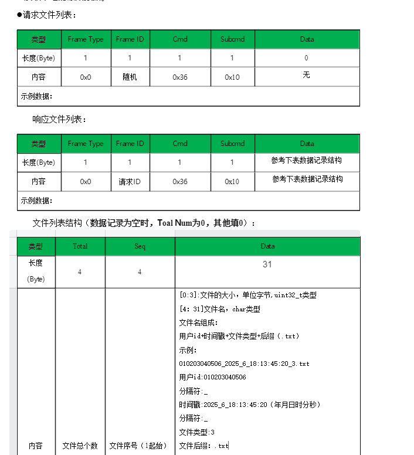  
完整版文件内容  

  
简化版文件内容  

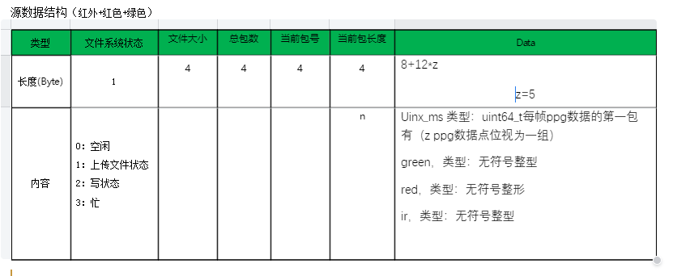  
一键上传所有文件  

  
响应文件上传进度  

  
格式化系统  


#### 3.3 固件升级（OTA）
**注：目前不建议使用，可以参考四、升级服务里的OTA升级**
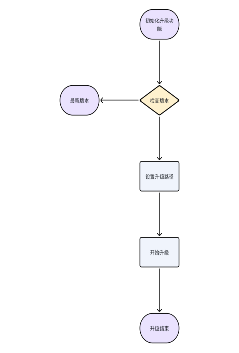
**注：这是phyOTA流程，其它芯片使用官方库**
[Nordic Android库链接](https://github.com/NordicSemiconductor/Android-DFU-Library)
[Nordic ios库链接](https://github.com/NordicSemiconductor/IOS-DFU-Library)
##### 3.3.1 检查版本
接口功能：检查固件版本是否是最新。  
接口声明：
```java
OtaApi.checkVersion(String version, VersionCallback versionCallback);
```
注意事项：调用此接口 ，需保证与戒指处于连接状态  
参数说明：version：当前戒指的版本号  
versionCallback：最新版本信息回调  
返回值：
```java
OtaApi.checkVersion(version, new VersionCallback() {
    @Override
    public void success(String newVersion) {
    //newVersion：云端最新版本号
        if (!StringUtils.isEmpty(newVersion)){
            //有新版本
        }else{
            //已是最新版本
        }
    }

    @Override
    public void error() {
        //获取最新版本失败
    }
});
```
##### 3.3.2 开始升级
接口功能：执行固件升级。  
接口声明：
```java
void startUpdate(BluetoothDevice bluetoothDevice, int rssi, LmOTACallback otaCallback)
```
注意事项：调用此接口 ，需保证与戒指处于连接状态,建议rssi <= -71(参考3.2.27 获取RSSI)并且电量>50  
参数说明：bluetoothDevice： 当前要升级的设备  
rssi：设备信号值  
otaCallback：升级回调  
返回值：
```java
OtaApi.startUpdate(App.getInstance().getDeviceBean().getDevice(), App.getInstance().getDeviceBean().getRssi(), new LmOTACallback() {
    @Override
    public void onDeviceStateChange(int i) {
        //设备状态回调
    }

    @Override
    public void onProgress(int i, int i1) {
        //升级进度
    }

    @Override
    public void onComplete() {
        //升级完成
    }
});
```
#### 3.4 数据库相关（DataApi）
##### 3.4.1 查询历史记录
接口功能：查询指定时间的历史数据  
接口声明：
```java
//查询历史数据
List<HistoryDataBean> queryHistoryData(long dayBeginTime,long dayEndTime,String mac) 
//查询历史数据按照时间进行正序
List<HistoryDataBean> queryHistoryDataOrderByTimeAsc(long dayBeginTime,long dayEndTime,String mac)
//查询历史数据按照步数进行倒叙
List<HistoryDataBean> queryHistoryDataOrderByStepCountDesc(long dayBeginTime,long dayEndTime,String mac)
```
**注意事项：计算睡眠时间的接口需要先调用查询历史数据**  
参数说明：dayBeginTime ：开始时间戳，单位：秒  
dayEndTime ：结束时间戳，单位：秒  
mac ：设备的MAC地址  
返回值：
```java
public class HistoryDataBean{
    @Id
    private Long id;
    private String mac;
     //总数据包数 4个字节
    private long totalNumber;
     // 当前第几包 4个字节
    private long indexNumber;
     // 当前记录时间 4个字节
    private long time;
     //今天累计步数 2个字节
    private int stepCount;
     // 心率 1个字节
    private int heartRate;
     // 血氧 1个字节
    private int bloodOxygen;
     //心率变异性 1个字节
    private int heartRateVariability;
     //精神压力指数 1个字节
    private int stressIndex;
     //温度 2个字节
    private int temperature;
    //运动激烈程度 1个字节
    private int exerciseIntensity;
    /**
     * 睡眠类型 1个字节
     * 0：无效
     * 1：清醒
     * 2：浅睡
     * 3：深睡
     * 4.眼动期
     */
    private int sleepType;
     // 保留 2个字节
    private int reserve;
     //RR间期 1个字节
    private int rrCount;
     //RR数组数据 1个字节
    private byte[] rrBytes;
 }
```
##### 3.4.2 清空历史数据
接口功能：清空全部历史数据。  
接口声明：
```java
void deleteHistoryData()；
```
注意事项：需开启相应权限  
参数说明：无  
返回值：无
#### 3.5 逻辑算法相关（LogicalApi）
##### 3.5.1 计算距离、卡路里
接口功能：根据步数计算距离、卡路里。  
接口声明：
```java
DistanceCaloriesBean calculateDistance(int stepCount,double height,double weight)；
```
注意事项：需开启相应权限  
参数说明：stepCount：步数  
height：身高 单位cm  
weight：体重 单位kg  
返回值：
```java
public class DistanceCaloriesBean {
    //距离，单位米
    private double distance;
    //卡路里，单位卡
    private double kcal;
}
```
##### 3.5.2 计算睡眠数据
**注：建议使用四、升级服务中的睡眠结果数据**
接口功能：计算指定时间睡眠数据。  
接口声明：
```java
SleepBean calculateSleep(String date, String mac, int type)；
```
**注意事项：计算睡眠时间的接口需要先调用查询历史数据，本地数据库仅供缓存，用户可以通过3.2.13 历史记录管理获取戒指历史数据**  

**常见问题：**  
问：如何获取历史数据？答：可以查询本地数据库获取历史数据，但是本地数据库不准，因为app删掉或者切换过戒指以后，数据库里数据会变动，可以通过（3.2.13 历史记录管理）获取戒指历史数据

问：如何保证睡眠数据正确？答：需要保证历史数据完整，睡眠算法默认计算从前一天18点到当天18点之间的数据，如果一个戒指，在A手机同步过未上传数据，在B手机同步时，会从A手机同步后的时间进行同步，这样B就会少掉A同步过的数据，数据链不完整，计算错误

问：什么时候获取所有历史数据，什么时候获取未上传历史数据？答：如果有自己服务器，可以将获取历史数据指令回调后的数据，同步到自己服务器，同步完成后，计算睡眠数据，从服务器拉取历史数据进行计算，这样就不怕切换戒指和删除app，只需要同步未上传数据即可。如果没有自己服务器，可以在首次安装app时，获取所有历史数据，后续都是获取未上传数据，如果睡眠计算出错，可以获取所有历史数据验证一下

问：计算睡眠数据需要什么流程？答：睡眠准确性需要保证数据准确性，所以需要先获取戒指历史数据（有服务器的，将未上传数据同步到服务器，，数据链应该是完整的，然后从服务器拉取数据），没有服务器的，可以先同步未上传历史数据，如果睡眠有问题，可能戒指在其他地方同步过，导致数据有部分中断，可以获取一下所有历史数据验证一下。
问：参数date应该传哪一天的值？答：算法计算的是所传日期的前一天18点到当天18点，所以如果想查询昨天的睡眠数据，传的应该是当天时间
参数说明：date：日期，格式为YYYY-MM-DD HH:mm:ss  
mac ：设备蓝牙MAC  
type：暂时无效  
返回值：
```java
public class SleepBean{
    //零星睡眠小时
    int hours = 0;
    //零星睡眠分钟
    int minutes = 0;
    //全部睡眠小时
    int allHours = 0;
    // 全部睡眠分钟
    int allMinutes =0;
    //睡眠小时
    int sleepHours = 0;
    //睡眠分钟
    int sleepMinutes =0;
    //深度睡眠时间
    long highTime = 0;
    //浅度睡眠时间
    long lowTime = 0;
    // 眼动时间
    long ydTime = 0;
    //清醒时间
    long qxTime = 0;
    //入睡时间戳
    long startTime = 0;
    //清醒时间戳
    long endTime = 0;
    //睡眠数据
    private List<HistoryDataBean> historyDataBeanList;
}
```
```java
public class Sleep2thBean {
 List<HistoryDataBean> sleepDataBeanList;
    long startTime;//第一次入睡时间
    long endTime;//最后一次醒来时间
    long sleepTime;//睡眠时长，包含清醒时间
    long deepTime ;//深睡眠时长
    long lowTime ;//浅睡眠时长
    long ydTime ;//眼动时间
    long qxTime;//清醒时长
    long seconds;//睡眠时长(秒)
    int hours;//睡眠时长(小时)，不包含清醒时间
    int minutes;//睡眠时长(分钟)，不包含清醒时间
    long sjTime;//实际睡眠时长
    double xiaolv;//睡眠效率
    double shenshui;//深睡比例
    int score ;//睡眠评分
    int wakeupCount;//清醒次数(传统睡眠返回)
    int waso;//入睡后的总清醒时间（单位分钟）,gomore算法使用
    String tips;//评价(保留)
    int sleepDataType;//1是1代睡眠，2是2代睡眠,3是gomore算法
    int voMax;//最大摄氧量

    double resultTemperture;//平均体温
    int xshours;//小睡使用shortSleepList，暂时用不到这个字段
    int xsminutes;//小睡使用shortSleepList，暂时用不到这个字段
    String xsAllhours;//小睡使用shortSleepList，暂时用不到这个字段
    String xsAllminutes;//小睡使用shortSleepList，暂时用不到这个字段
    String sleepLog;//计算睡眠产生的日志
    List<HistoryDataBean> historyBeanList;
    String noSleepResult;//无睡眠的原因
    List<Sleep2thBean> shortSleepList;//短睡眠列表
}
```
数据库中数据
```java
public class HistoryDataBean{
    @Id
    private Long id;
    private String mac;
     // 总数据包数 4个字节
    private long totalNumber;
     // 当前第几包 4个字节
    private long indexNumber;
     // 当前记录时间 4个字节
    private long time;
     // 今天累计步数 2个字节
    private int stepCount;
     // 心率 1个字节
    private int heartRate;
     // 血氧 1个字节
    private int bloodOxygen;
     // 心率变异性 1个字节
    private int heartRateVariability;
     // 精神压力指数 1个字节
    private int stressIndex;
     // 温度 2个字节
    private int temperature;
     // 运动激烈程度 1个字节
    private int exerciseIntensity;
    /**
     * 睡眠类型 1个字节
     * 0：无效
     * 1：清醒
     * 2：浅睡
     * 3：深睡
     * 4.眼动期
     */
    private int sleepType;
     // 保留 2个字节
    private int reserve;
     // RR间期 1个字节
    private int rrCount;
     // RR数组数据 1个字节
    private byte[] rrBytes;
 }
```
##### 3.5.3 睡眠数据绘图相关
如果需要绘图，比如清醒时间，深睡时间等，需要将原始数据进行处理一下，处理代码是：
```java
initSleepChat(thBean.getStartTime(),thBean.getSleepDataBeanList());
//thBean是接口返回的Sleep2thBean
public void initSleepChat( long showStartTime,List<HistoryDataBean> historyDataBeanList) {
        List<SleepChartBean> list = new ArrayList<>();
        int totalCount = 0;//记录条数
        int lastType = 0;
        long endTime = 0;
        boolean wakeUp = false;
        for (int i = 0; i < historyDataBeanList.size(); i++) {
            HistoryDataBean dataBean = historyDataBeanList.get(i);
            String time = DateUtils.longToString(dataBean.getTime() * 1000, "yyyy-MM-dd HH:mm");

            totalCount++;
            if (lastType == 0) {
                if(dataBean.getSleepType()>1){
                    lastType = dataBean.getSleepType();
                    list.add(new SleepChartBean(lastType, time, time));

                }

            } else if (lastType != dataBean.getSleepType()) {
                long changeTime = historyDataBeanList.get(i -1).getTime();
                time = DateUtils.longToString(changeTime * 1000, "yyyy-MM-dd HH:mm");
                list.get(list.size() - 1).setEndTime(time);
                long longtime = dataBean.getTime()-historyDataBeanList.get(i-1).getTime();
                lastType = dataBean.getSleepType();
                if(longtime < 90 * 60) {//两条数据相差不超过90分钟
                    list.add(new SleepChartBean(lastType, time, time));
                }
            }

            if(i >0 ){//识别间隔时间
                long longtime = dataBean.getTime()-historyDataBeanList.get(i-1).getTime();

                if(longtime>90*60){//超出一个小时
                  long  setEnd=DateUtils.stringToLong(list.get(list.size() - 1).getEndTime(), "yyyy-MM-dd HH:mm");
                    String endTime1 = DateUtils.longToString(setEnd, "yyyy-MM-dd HH:mm");
                    list.get(list.size() - 1).setEndTime(endTime1);
                    list.get(list.size() - 1).setSleepType(historyDataBeanList.get(i-1).getSleepType());
                    endTime = DateUtils.stringToLong(list.get(list.size() - 1).getEndTime(), "yyyy-MM-dd HH:mm");

                    break;//终止循环
                }
            }
            if (list.size() > 0 && (totalCount == historyDataBeanList.size() || wakeUp)) { //最后一条数据
                list.get(list.size() - 1).setEndTime(time);
                list.get(list.size() - 1).setSleepType(dataBean.getSleepType());
                endTime = DateUtils.stringToLong(list.get(list.size() - 1).getEndTime(), "yyyy-MM-dd HH:mm");
                break;//终止循环
            }
        }
            //showStartTime 睡眠开始时间
           //endTime睡眠结束时间
    }
```
```java

    /**
     * 将字符串转换为时间戳
     */
    public static long stringToLong(String time, String format) {
        SimpleDateFormat sdf = new SimpleDateFormat(format);
        Date date = new Date();
        try {
            date = sdf.parse(time);
        } catch (ParseException e) {
            e.printStackTrace();
        }
        return date.getTime();
    }

    /**
     * 将时间戳转换为字符串
     *
     * @param time   时间戳
     * @param format 字符串格式  例如:yyyy-MM-dd HH:mm:ss
     * @return
     */
    public static String longToString(long time, String format) {
        SimpleDateFormat formatter = new SimpleDateFormat(format);
        Date curDate = new Date(time);
        return formatter.format(curDate);
    }
```
处理完以后得数据，可以根据sleepType来判断是否睡眠状态数据
1：清醒
2：浅睡
3：深睡
4：快速眼动
用户可以根据这些类别，按照时间排序，计算出清醒等的开始时间和结束时间

如果有午睡，可以算成零星小睡
```java
 /**
     * 计算零星睡眠
     */
    private void otherSleep( List<HistoryDataBean> historyDataBeanList) {
        long preTime = 0;
        boolean otherIsexist = false;
        boolean otherIsover = false;
        long showTimeStart = 0;
        long showTimeEnd = 0;

        for (HistoryDataBean historyDataBean : historyDataBeanList) {
            int sleepType = historyDataBean.getSleepType();
            if (sleepType == 0) {
                continue;
            }
            String time = DateUtils.longToString(historyDataBean.getTime() * 1000, "yyyy-MM-dd HH:mm");
         //   Logger.show("xiaoshui", "type=" + sleepType + ";" + time);

            if (otherIsover){//零星小睡已经结束
                continue;
            }
            if (!otherIsexist){//未发现小睡
                if (sleepType <= 1){
                    continue;
                }

                LocalDateTime thisTime = LocalDateTime.ofInstant(Instant.ofEpochMilli(historyDataBean.getTime() * 1000l), ZoneId.systemDefault());
                if (thisTime.getHour() >= 12 & thisTime.getHour() <= 14){                    //在合法的入睡范围内
                    showTimeStart = historyDataBean.getTime();
                    showTimeEnd = historyDataBean.getTime();
                    preTime = showTimeStart;
                    otherIsexist = true;
                    otherIsover = false;
                 //   Logger.show("xiaoshui", "开始零星小睡");
                }else {
                    continue;//不在合法的入睡范围内
                }
            }else {//已经进小睡
                if (historyDataBean.getTime() - preTime >= 12 * 60){                    //漏数据的恢复处理
                    otherIsexist = false;
                    continue;
                }
                preTime = historyDataBean.getTime();

                if (sleepType > 1){
                    showTimeEnd = historyDataBean.getTime();
                }else {
                    if (showTimeEnd - showTimeStart >= 20 * 60){
                        otherIsover = true;
                   //     Logger.show("xiaoshui", "零星小睡有效");
                    }else{
                        otherIsexist = false;
                   //     Logger.show("xiaoshui", "零星小睡无效");
                    }
                }
            }
        }

        if (otherIsover) {
            tv_all_hour.setText((TimeUtils.date2String(new Date(showTimeStart * 1000), TimeUtils.HH_MM)));
            tv_all_min.setText((TimeUtils.date2String(new Date(showTimeEnd * 1000), TimeUtils.HH_MM)));

            long seconds = showTimeEnd - showTimeStart;
            int hours = (int) (seconds / 3600);
            int minutes = (int) ((seconds % 3600) / 60);
            tv_other_hour.setText(String.format("%02d", hours));
            tv_other_min.setText(String.format("%02d", minutes));
        } 
    }
```
##### 3.5.4 睡眠问题反馈协查
如果出现睡眠不准确，或者没有睡眠数据的情况，尤其是调用升级服务睡眠相关接口以后，一般排查步骤有三个:  
1.如果戒指在身边，并且身边有可用的上位机，将戒指里的历史数据导出文档，发给我们，可以迅速排查是否固件问题  
2.戒指没在身边，可以将用户账号发送给我们，我们后台来排查数据  
3.虽然可以通过2来排查问题，但是因为涉及到网络传输，不好确定是固件就没有数据，还是上传途中丢数据，还是app没有上传，所以可以参考公版app的问题反馈机制  
问题反馈流程：  
我们会把一些重要的数据，保存到app本地，写入到文本文件里，然后压缩上传到服务器上，同时会给相关开发人员发送邮件，管理端也可以看到问题反馈记录，并且可以下载问题反馈文件，进行问题分析  
目前sdk已经提供了一些日志，日志文件在"\Android\data\包名\files\LM"，记录了蓝牙连接日志(BLEService.txt)和蓝牙指令日志(command.txt)，并且提供了写入方法  
```java
  ImageSaverUtil.saveImageToInternalStorage(application,"发送指令="+str_data,"LM","command.txt",true);
//boolean isAppend 目前没有效果，都是添加模式

public class ImageSaverUtil {
    private static ReentrantLock lock = new ReentrantLock();
    // 写入sd卡需要保证线程使用
    public static void saveImageToInternalStorage(Context context, String data, String folderName, String name,boolean isAppend) {
        new Thread(() -> {
            lock.lock();
            String savedImagePath = null;
            if (Build.VERSION.SDK_INT >= 29) {
//                File folder = new File(Environment.getExternalStoragePublicDirectory(Environment.DIRECTORY_DOWNLOADS), folderName);
                File folder=new File(FileUtil.getSDPath(context, folderName));
                if (!folder.exists()) {
                    folder.mkdirs();
                }
                try {
                    // Create a request to save the image to the app's internal storage
                    File imageFile = new File(folder, folderName +  name);
                    if (!imageFile.getParentFile().exists()) {
                        imageFile.getParentFile().mkdirs();
                        imageFile.createNewFile();
                    }
                    FileOutputStream outStream = new FileOutputStream(imageFile.getAbsolutePath(), true);
                    OutputStreamWriter outputStream = new OutputStreamWriter(outStream, "utf-8");
                    outputStream.write(TimeUtils.date2String(new Date()));
                    outputStream.write(data);
                    outputStream.write("\n");
                    outputStream.flush();
                    // Close the streams
                    outputStream.close();

                    savedImagePath = imageFile.getAbsolutePath();
                } catch (Exception e) {
                    e.printStackTrace();
                }
                // Use the Scoped Storage APIs on Android 12 and higher
                Log.d("ImageSaver", "Saved image to path: " + savedImagePath);
            }
            lock.unlock();

        }).start();

    }
```
可以在重要的部分，将数据主动写入日志，目前sdk里没有提供历史数据保存到日志的代码，可以自己添加，  
```java


  /**
     * 获取历史数据
     *
     * @return
     */
    public Completable readHistoryObservable(int historyType) {
        return Completable.create(emitter -> {
            uploadHistoryData.clear();
           // long time = DateUtils.stringToLong("2025-03-28 00:00:00","yyyy-MM-dd HH:mm");
            //time/1000
            //第一次连接戒指，同步一下云端最新数据的时间，后续直接读取未上传数据就行
            LmAPILite.READ_HISTORY(historyType,latestHistoryTime, new IHistoryListenerLite() {
                @Override
                public void error(int code) {
                   readHistoryError();
                    emitter.onCompleted();
                   
                }

                @Override
                public void success() {
                    latestHistoryTime=0;//重置时间，后续都读取未上传数据
                    readHistorySuccess(false);
                    emitter.onCompleted();
                   
                }

                @Override
                public void progress(double progress, HistoryDataBean historyDataBean) {
                    uploadHistoryData.add(historyDataBean);
                    readHistoryProgress();

                }

                @Override
                public void clearHistory() {
                    emitter.onCompleted();
                }
            });
        }).delay(300, TimeUnit.MILLISECONDS); // 延时300ms;;

    }

```
在readHistorySuccess方法里，将获取到的历史数据上传一下
```java
  try {
            ImageSaverUtilLib.saveImageToInternalStorage(MainActivity.this, "戒指本地数据readHistorySuccess=" + App.getInstance().getGson().toJson(uploadHistoryData), "LM", "command.txt", true);

        } catch (Exception e) {
            e.printStackTrace();
        }
```
这样即使没有上位机，戒指也不在身边，让用户从相关路径下，导出日志，也能根据日志，分析部分问题。  
更方便的情况是，将日志压缩上传到服务器，服务器保存日志，提供下载入口，这样可以方便用户，不需要自己去导出日志  
公版上传逻辑：  
```java
   findViewById(R.id.btn_submit).setOnClickListener(v -> {
            ImageSaverUtilLib.saveImageToInternalStorage(FeedbackActivity.this, "问题反馈", "LM", "buttonClick.txt", true);

            content = tv_content.getText().toString().trim();
            if (StringUtils.isEmpty(content)) {
                ToastUtils.show(getRsString(R.string.printf_feed));
                return;
            }
            List<HistoryDataBean> historyDataBeanList = DataApi.instance.queryHistoryAllData();

            ImageSaverUtilLib.saveImageToInternalStorage(App.getInstance(), "本地数据库数据:"+App.getInstance().getGson().toJson(historyDataBeanList), "LM", "LocalHistoryDatas.txt", false);
             String pass = FileUtil.getSDPath(FeedbackActivity.this,"LM.zip");

            File Pass = new File(pass);

            //大于2M就删除新建，防止卡死
            double fileSize = FileUtil.getFileSize(Pass, ConstUtils.MemoryUnit.MB);
            if(fileSize>2){

                try {
                    Pass.delete();
                    Pass.createNewFile();
                }catch (Exception e){
                    e.printStackTrace();
                }

            }
            setMessage("压缩文件中");
            new Thread(() -> {
                try {
                    FolderCompressor.compressFolder(FileUtil.getSDPath(FeedbackActivity.this,"LM"), pass);
                    runOnUiThread(() -> {
                        dismissProgressDialog();
                        // 更新 UI，提示用户压缩完成
                        getPresenter().upload(Pass);
                    });
                } catch (IOException e) {
                    e.printStackTrace();
                    runOnUiThread(() -> {
                        // 处理错误
                    });
                }
            }).start();


        });
    }
```
```java
  /**
     * 上传文件
     *
     * @param file 上传文件
     * @return
     */
    public static Observable<JsonResult> upload(File file) {
        // 创建 RequestBody 对象
        RequestBody requestFile = RequestBody.create(MediaType.parse("multipart/form-data"), file);
        // 创建 MultipartBody.Part 对象
        MultipartBody.Part body = MultipartBody.Part.createFormData("file", file.getName(), requestFile);
        return ServerAPIClient.getApi().upload(body).subscribeOn(Schedulers.io())
                .unsubscribeOn(Schedulers.io())
                .observeOn(AndroidScheduler.mainThread());
    }
```
FolderCompressor
```java
public class FolderCompressor {

    public static void compressFolder(String folderPath, String zipFilePath) throws IOException {
        try (FileOutputStream fos = new FileOutputStream(zipFilePath);
             ZipOutputStream zipOut = new ZipOutputStream(fos)) {
            File folderToZip = new File(folderPath);
            zipFolder(folderToZip, folderToZip.getName(), zipOut);
        }
    }

    private static void zipFolder(File folder, String baseName, ZipOutputStream zipOut) throws IOException {
        File[] files = folder.listFiles();
        if (files != null) {
            for (File file : files) {
                if (file.isDirectory()) {
                    zipFolder(file, baseName + "/" + file.getName(), zipOut);
                } else {
                    try (FileInputStream fis = new FileInputStream(file)) {
                        ZipEntry zipEntry = new ZipEntry(baseName + "/" + file.getName());
                        zipOut.putNextEntry(zipEntry);

                        byte[] bytes = new byte[1024];
                        int length;
                        while ((length = fis.read(bytes)) >= 0) {
                            zipOut.write(bytes, 0, length);
                        }
                    }
                }
            }
        }
    }

}

```
FileUtil
```java
 public static String getSDPath(Context ctx, String fileName) {
        try{
            File sdDir = null;
            boolean sdCardExist = Environment.getExternalStorageState().equals(
                    Environment.MEDIA_MOUNTED);// 判断sd卡是否存在
            if (sdCardExist) {
                if (Build.VERSION.SDK_INT >= 29) {
                    //Android10之后
                    sdDir = ctx.getExternalFilesDir(null);
//                sdDir=  ctx.getExternalCacheDir();
                } else {
                    sdDir= Environment.getExternalStoragePublicDirectory(Environment.DIRECTORY_DOWNLOADS);
                }
            } else {
                sdDir = Environment.getRootDirectory();// 获取跟目录
            }
            if(!TextUtils.isEmpty(fileName)){
                return sdDir.toString()+"/"+fileName;
            }
            return sdDir.toString();
        }catch (Exception e){
            e.printStackTrace();
        }
        return null;

    }

  /**
     * 获取文件大小
     * <p>例如：getFileSize(file, ConstUtils.MB); 返回文件大小单位为MB</p>
     *
     * @param file 文件
     * @param unit <ul>
     *             <li>{@link ConstUtils.MemoryUnit#BYTE}: 字节</li>
     *             <li>{@link ConstUtils.MemoryUnit#KB}  : 千字节</li>
     *             <li>{@link ConstUtils.MemoryUnit#MB}  : 兆</li>
     *             <li>{@link ConstUtils.MemoryUnit#GB}  : GB</li>
     *             </ul>
     * @return 文件大小以unit为单位
     */
    public static double getFileSize(File file, ConstUtils.MemoryUnit unit) {
        if (!isFileExists(file)) return -1;
        return byte2Size(file.length(), unit);
    }

    /**
     * 字节数转以unit为单位的size
     *
     * @param byteNum 大小
     * @param unit <ul>
     *             <li>{@link ConstUtils.MemoryUnit#BYTE}: 字节</li>
     *             <li>{@link ConstUtils.MemoryUnit#KB}  : 千字节</li>
     *             <li>{@link ConstUtils.MemoryUnit#MB}  : 兆</li>
     *             <li>{@link ConstUtils.MemoryUnit#GB}  : GB</li>
     *             </ul>
     * @return 以unit为单位的size
     */
    public static double byte2Size(long byteNum, ConstUtils.MemoryUnit unit) {
        switch (unit) {
            default:
            case BYTE:
                return (double) byteNum / ConstUtils.BYTE;
            case KB:
                return (double) byteNum / ConstUtils.KB;
            case MB:
                return (double) byteNum / ConstUtils.MB;
            case GB:
                return (double) byteNum / ConstUtils.GB;
        }
    }
```
后台代码  
```java
 /**
     * 通用上传请求（单个）
     */
    @PostMapping("/upload")
    public AjaxResult uploadFile(MultipartFile file) throws Exception {
        try {
            // 上传文件路径
            String filePath = getUploadPath();
            log.info("上传文件路径：{}", filePath);
            // 上传并返回新文件名称
            String fileName = FileUploadUtils.upload(filePath, file);
            String url = serverConfig.getUrl() + fileName;
            JSONObject jsonObject = new JSONObject();
            jsonObject.put("url", url);
            jsonObject.put("fileName", fileName);
            return AjaxResult.success(jsonObject);
        } catch (Exception e) {
            e.printStackTrace();
            return AjaxResult.error(e.getMessage());
        }
    }
```
FileUploadUtils
```java
public class FileUploadUtils {
    /**
     * 默认大小 50M
     */
    public static final long DEFAULT_MAX_SIZE = 50 * 1024 * 1024;

    /**
     * 默认的文件名最大长度 100
     */
    public static final int DEFAULT_FILE_NAME_LENGTH = 100;

    /**
     * 默认上传的地址
     */
    private static String defaultBaseDir = RuoYiConfig.getProfile();

    public static void setDefaultBaseDir(String defaultBaseDir) {
        FileUploadUtils.defaultBaseDir = defaultBaseDir;
    }

    public static String getDefaultBaseDir() {
        return defaultBaseDir;
    }

    /**
     * 以默认配置进行文件上传
     *
     * @param file 上传的文件
     * @return 文件名称
     * @throws Exception
     */
    public static final String upload(MultipartFile file) throws IOException {
        try {
            return upload(getDefaultBaseDir(), file, MimeTypeUtils.DEFAULT_ALLOWED_EXTENSION);
        } catch (Exception e) {
            throw new IOException(e.getMessage(), e);
        }
    }

    /**
     * 根据文件路径上传
     *
     * @param baseDir 相对应用的基目录
     * @param file    上传的文件
     * @return 文件名称
     * @throws IOException
     */
    public static final String upload(String baseDir, MultipartFile file) throws IOException {
        try {
            return upload(baseDir, file, MimeTypeUtils.DEFAULT_ALLOWED_EXTENSION);
        } catch (Exception e) {
            throw new IOException(e.getMessage(), e);
        }
    }

    /**
     * 文件上传
     *
     * @param baseDir          相对应用的基目录
     * @param file             上传的文件
     * @param allowedExtension 上传文件类型
     * @return 返回上传成功的文件名
     * @throws FileSizeLimitExceededException       如果超出最大大小
     * @throws FileNameLengthLimitExceededException 文件名太长
     * @throws IOException                          比如读写文件出错时
     * @throws InvalidExtensionException            文件校验异常
     */
    public static final String upload(String baseDir, MultipartFile file, String[] allowedExtension)
            throws FileSizeLimitExceededException, IOException, FileNameLengthLimitExceededException,
            InvalidExtensionException {
        int fileNamelength = Objects.requireNonNull(file.getOriginalFilename()).length();
        if (fileNamelength > FileUploadUtils.DEFAULT_FILE_NAME_LENGTH) {
            throw new FileNameLengthLimitExceededException(FileUploadUtils.DEFAULT_FILE_NAME_LENGTH);
        }

        assertAllowed(file, allowedExtension);

        String fileName = extractFilename(file);

        String absPath = getAbsoluteFile(baseDir, fileName).getAbsolutePath();
        file.transferTo(Paths.get(absPath));
        return getPathFileName(baseDir, fileName);
    }

    /**
     * 上传文件，保持原来的名称
     * @param baseDir
     * @param file
     * @param allowedExtension
     * @return
     * @throws FileSizeLimitExceededException
     * @throws IOException
     * @throws FileNameLengthLimitExceededException
     * @throws InvalidExtensionException
     */
    public static final String uploadMaintainOriginalName(String baseDir, MultipartFile file, String[] allowedExtension)
            throws FileSizeLimitExceededException, IOException, FileNameLengthLimitExceededException,
            InvalidExtensionException {
        int fileNamelength = Objects.requireNonNull(file.getOriginalFilename()).length();
        if (fileNamelength > FileUploadUtils.DEFAULT_FILE_NAME_LENGTH) {
            throw new FileNameLengthLimitExceededException(FileUploadUtils.DEFAULT_FILE_NAME_LENGTH);
        }

        assertAllowed(file, allowedExtension);

        String fileName = extractFilename2(file);

        String absPath = getAbsoluteFile(baseDir, fileName).getAbsolutePath();
        file.transferTo(Paths.get(absPath));
        return getPathFileName(baseDir, fileName);
    }

    /**
     * 编码文件名
     */
    public static final String extractFilename(MultipartFile file) {
        return StringUtils.format("{}/{}_{}.{}", DateUtils.datePath(),
                FilenameUtils.getBaseName(file.getOriginalFilename()), Seq.getId(Seq.uploadSeqType), getExtension(file));
    }

    /**
     * 编码文件名
     */
    public static final String extractFilename2(MultipartFile file) {
        return StringUtils.format("{}/{}.{}", DateUtils.datePath(),
                FilenameUtils.getBaseName(file.getOriginalFilename()), getExtension(file));
    }
    public static final File getAbsoluteFile(String uploadDir, String fileName) throws IOException {
        File desc = new File(uploadDir + File.separator + fileName);

        if (!desc.exists()) {
            if (!desc.getParentFile().exists()) {
                desc.getParentFile().mkdirs();
            }
        }
        return desc;
    }

    public static final String getPathFileName(String uploadDir, String fileName) throws IOException {
        int dirLastIndex = RuoYiConfig.getProfile().length() + 1;
        String currentDir = StringUtils.substring(uploadDir, dirLastIndex);
        return Constants.RESOURCE_PREFIX + "/" + currentDir + "/" + fileName;
    }

    /**
     * 文件大小校验
     *
     * @param file 上传的文件
     * @return
     * @throws FileSizeLimitExceededException 如果超出最大大小
     * @throws InvalidExtensionException
     */
    public static final void assertAllowed(MultipartFile file, String[] allowedExtension)
            throws FileSizeLimitExceededException, InvalidExtensionException {
        long size = file.getSize();
        if (size > DEFAULT_MAX_SIZE) {
            throw new FileSizeLimitExceededException(DEFAULT_MAX_SIZE / 1024 / 1024);
        }

        String fileName = file.getOriginalFilename();
        String extension = getExtension(file);
        if (allowedExtension != null && !isAllowedExtension(extension, allowedExtension)) {
            if (allowedExtension == MimeTypeUtils.IMAGE_EXTENSION) {
                throw new InvalidExtensionException.InvalidImageExtensionException(allowedExtension, extension,
                        fileName);
            } else if (allowedExtension == MimeTypeUtils.FLASH_EXTENSION) {
                throw new InvalidExtensionException.InvalidFlashExtensionException(allowedExtension, extension,
                        fileName);
            } else if (allowedExtension == MimeTypeUtils.MEDIA_EXTENSION) {
                throw new InvalidExtensionException.InvalidMediaExtensionException(allowedExtension, extension,
                        fileName);
            } else if (allowedExtension == MimeTypeUtils.VIDEO_EXTENSION) {
                throw new InvalidExtensionException.InvalidVideoExtensionException(allowedExtension, extension,
                        fileName);
            } else {
                throw new InvalidExtensionException(allowedExtension, extension, fileName);
            }
        }
    }

    /**
     * 判断MIME类型是否是允许的MIME类型
     *
     * @param extension
     * @param allowedExtension
     * @return
     */
    public static final boolean isAllowedExtension(String extension, String[] allowedExtension) {
        for (String str : allowedExtension) {
            if (str.equalsIgnoreCase(extension)) {
                return true;
            }
        }
        return false;
    }

    /**
     * 获取文件名的后缀
     *
     * @param file 表单文件
     * @return 后缀名
     */
    public static final String getExtension(MultipartFile file) {
        String extension = FilenameUtils.getExtension(file.getOriginalFilename());
        if (StringUtils.isEmpty(extension)) {
            extension = MimeTypeUtils.getExtension(Objects.requireNonNull(file.getContentType()));
        }
        return extension;
    }
}
```
MimeTypeUtils
```java
public class MimeTypeUtils
{
    public static final String IMAGE_PNG = "image/png";

    public static final String IMAGE_JPG = "image/jpg";

    public static final String IMAGE_JPEG = "image/jpeg";

    public static final String IMAGE_BMP = "image/bmp";

    public static final String IMAGE_GIF = "image/gif";
    
    public static final String[] IMAGE_EXTENSION = { "bmp", "gif", "jpg", "jpeg", "png" };

    public static final String[] FLASH_EXTENSION = { "swf", "flv" };

    public static final String[] MEDIA_EXTENSION = { "swf", "flv", "mp3", "wav", "wma", "wmv", "mid", "avi", "mpg",
            "asf", "rm", "rmvb" };

    public static final String[] VIDEO_EXTENSION = { "mp4", "avi", "rmvb" };

    public static final String[] DEFAULT_ALLOWED_EXTENSION = {
            // 图片
            "bmp", "gif", "jpg", "jpeg", "png",
            // word excel powerpoint
            "doc", "docx", "xls", "xlsx", "ppt", "pptx", "html", "htm", "txt", "pdf",
            // 压缩文件
            "rar", "zip", "gz", "bz2","apk",
            // 视频格式
            "mp4", "avi", "rmvb",
            // pdf
            "pdf","hex16", "bin"};

    public static String getExtension(String prefix)
    {
        switch (prefix)
        {
            case IMAGE_PNG:
                return "png";
            case IMAGE_JPG:
                return "jpg";
            case IMAGE_JPEG:
                return "jpeg";
            case IMAGE_BMP:
                return "bmp";
            case IMAGE_GIF:
                return "gif";
            default:
                return "";
        }
    }
}

```
后续的管理端下载，邮件发送，可以让自己公司后台进行开发


## 四、升级服务
### 1、服务介绍
为了进一步简化用户对接流程，提高算法质量，共享固件资源，将公版app所用的服务进行共享(1.0.34版本后新增)，仅需要3个步骤，就可以使用升级服务(服务的接口是http的，如果调用方使用的是https，需要同时兼容两种模式，如调用服务无响应，可能是因为CLEARTEXT communication to XX not permitted by network security policy 这样的错误)
### 1、申请key
合作方可以联系我们，提供贵公司的名称，我们分配调用服务的key
### 2、申请token
根据key，和使用sdk的用户的手机号或者邮箱，就可以申请token，token会自动保存在本地，不需要用户保存，尽量在合适的时候，调用这个接口，刷新一下Token，防止被踢或者Token过期
```java
//方法说明
public static void createToken(String key,String userName, ICreateToken iCreateToken)
//使用
 LogicalApi.createToken("","", new ICreateToken() {
            @Override
            public void getTokenSuccess() {

            }

            @Override
            public void error(String msg) {

            }
        });

```
### 3、调用服务
根据token，调用服务，目前提供获取用户睡眠数据的服务，ota升级服务，血压和血糖算法，根据固件类别获取固件信息,timeline(时间线，包括行走和跑步)
### 4、支持的服务
##### 1、睡眠结果数据（仅为部分厂家提供支持，需要联系我司对接key）
可以根据开始时间和结束时间，获取当前用户的睡眠结果数据，系统根据历史数据，自动区分一代睡眠和二代睡眠，调用该服务的前提，是需要在获取戒指历史数据的时候，将历史数据上传，否则无法计算，这个接口会把之前调用这个接口，由于服务器原因，没能上传成功的数据上传上去，所以如果存在切换用户的需求，可以在切换之前，清除一下上传错误的数据，或者上传一下，否则有可能把之前登录人员的数据，同步到当前登录人数据中
```java
DataApi.instance.deleteHistoryErrorBatch();
```
```java
   //如需使用更精准的睡眠算法，获取戒指历史数据时，请调用该指令(LmAPI.READ_HISTORY不支持上传服务器操作)，这个支持一代协议,(byte) 0x00是未上传历史，(byte) 0x01是所有历史，正常情况下传0x00就可以了
   LmAPI.READ_HISTORY_UPDATE_TO_SERVER((byte) 0x00,  mac, new IHistoryListener() {
                    @Override
                    public void error(int code) {
                        if (code == 3) {
                            postView("\n出现了BIX的问题");
                        }
                        setMessage(TestActivity.this, "\n出现了BIX的问题");
                    }

                    @Override
                    public void success() {
                        postView("\n读取记录完成");

                    }

                    @Override
                    public void progress(double progress, HistoryDataBean historyDataBean) {
                        if (historyDataBean != null) {
                            postView("\n读取记录进度:" + progress + "%");
                            postView("\n记录内容:" + historyDataBean.toString());
                        }

                    }
                }, new IWebHistoryResult() {
                    @Override
                    public void updateHistoryFinish() {
                        postView("\n历史数据上传服务器完成");
                    }
                });
```
如果使用的是二代协议，除非需要读取特定时间以后的历史数据，或者需要在特定场合，主动读取历史数据，否则不需要使用READ_HISTORY_UPDATE_TO_SERVER。因为二代协议是会自动上传历史数据的，需要在页面上设置监听，使用下述方法上传历史数据
```java
READ_HISTORY_AUTO_UPDATE_TO_SERVER(  String mMac, IHistoryListenerLite listenerLite, IWebHistoryResult mWebHistoryResult)
```
获取睡眠数据，需要在updateHistoryFinish回调里获取，保证云端数据已经保存，才能计算出睡眠数据，可以延时1s左右，保证能准确获取
```java
                postView("\n从云端计算睡眠");
                String dateTimeString = "2025-02-12 23:59:59";

                LogicalApi.getSleepDataFromService( dateTimeString, new IWebSleepResult() {
                    @Override
                    public void sleepDataSuccess(Sleep2thBean sleep2thBean) {
                        // 定义日期时间格式
                        SimpleDateFormat sdf = new SimpleDateFormat("yyyy-MM-dd HH:mm:ss");
                        // 将时间戳转换为 Date 对象
                        Date startDate = new Date(sleep2thBean.getStartTime()*1000);
                        // 将时间戳转换为 Date 对象
                        Date endDate = new Date(sleep2thBean.getEndTime()*1000);
                        postView("\n入睡时间:" + sdf.format(startDate)+"\n清醒时间:" +sdf.format(endDate)+"\n睡眠小时:" + sleep2thBean.getHours()+"\n睡眠分钟:" + sleep2thBean.getMinutes() );

                    }

                    @Override
                    public void error(String message) {

                    }

                });

//根据日期组合，批量获取睡眠记录，日期格式类似于 "2025-05-11"

LogicalApi.getSleepDataBatchFromService(List<String> dates, IWebSleepResult webApiResult)
//返回的数据结构

public class Sleep2thBean {
    List<HistoryDataBean> sleepDataBeanList;
    long startTime;//第一次入睡时间
    long endTime;//最后一次醒来时间
    long sleepTime;//睡眠时长，包含清醒时间
    long deepTime ;//深睡眠时长
    long lowTime ;//浅睡眠时长
    long ydTime ;//眼动时间
    long qxTime;//清醒时长
    long seconds;//睡眠时长(秒)
    int hours;//睡眠时长(小时)，不包含清醒时间
    int minutes;//睡眠时长(分钟)，不包含清醒时间
    long sjTime;//实际睡眠时长
    double xiaolv;//睡眠效率
    double shenshui;//深睡比例
    int score ;//睡眠评分
    int wakeupCount;//清醒次数(传统睡眠返回)
    int waso;//入睡后的总清醒时间（单位分钟）,gomore算法使用
    String tips;//评价(保留)
    int sleepDataType;//1是1代睡眠，2是2代睡眠,3是gomore算法
    int voMax;//最大摄氧量

    double resultTemperture;//平均体温
    int xshours;//小睡使用shortSleepList，暂时用不到这个字段
    int xsminutes;//小睡使用shortSleepList，暂时用不到这个字段
    String xsAllhours;//小睡使用shortSleepList，暂时用不到这个字段
    String xsAllminutes;//小睡使用shortSleepList，暂时用不到这个字段
    String sleepLog;//计算睡眠产生的日志
    List<HistoryDataBean> historyBeanList;
    String noSleepResult;//无睡眠的原因
    List<Sleep2thBean> shortSleepList;//短睡眠列表
```
##### 服务器端超时，导致戒指未成功上传，睡眠不显示的解决办法：
因为一般建议是上传戒指的未上传数据，如果是从戒指里正确获取了数据，但是因为网络问题，或者服务器问题，没有将数据上传到服务器，导致睡眠不会显示，下一次同步数据的时候，是从上一次戒指上传完后的最后一条数据的时间戳开始，所以在服务器上，中间的数据就会丢掉。  
解决办法：下一次同步时，先获取服务器上当前用户的最后一条历史时间戳，然后调用戒指上传记录指令的时候，传入该时间戳，就会从该时间戳以后上传，这样就能保证服务器上数据的完整性了
```java
LogicalApi:
 public static void loadUserLatestHistory( IWebLastTimeResult iWebLastTimeResult)

建议在createToken接口调用成功后，调用这个接口，尽量在蓝牙连接之前，获取到时间戳
LmAPI:
 public static void READ_HISTORY_UPDATE_TO_SERVER(byte type, long timeMillis)
将timeMillis设置为loadUserLatestHistory获取的时间戳
```
##### 2、GoMore睡眠
Gomore睡眠是集成在戒指里，可以直接通过指令，获取用户睡眠信息，用户可以保存睡眠信息到自己服务器，也可以调用我们的接口，保存到我们云端。如果要保证GoMore算法可以正常使用，需要进行授权。
步骤：
1.需要调用指令，获取设备的deviceID  
2.调用授权接口，传入deviceID，获取key
3.然后调用指令，将key写入到戒指里

首先通过二代协议的返回值，判断戒指是否支持Gomore睡眠
```java
   private int gomoreSleep;//固件是否支持gomore睡眠算法,1支持0不支持
```
##### 授权：

##### 睡眠上传和获取
睡眠相关的新接口，已经兼容了传统睡眠和Gomore睡眠，改动很小，新增了一些字段，包括小睡列表（传统睡眠算法后续会增加，目前只有Gomore算法支持）
```java
public class Sleep2thBean {
    List<HistoryDataBean> sleepDataBeanList;
    long startTime;//第一次入睡时间
    long endTime;//最后一次醒来时间
    long sleepTime;//睡眠时长，包含清醒时间
    long deepTime ;//深睡眠时长
    long lowTime ;//浅睡眠时长
    long ydTime ;//眼动时间
    long qxTime;//清醒时长
    long seconds;//睡眠时长(秒)
    int hours;//睡眠时长(小时)，不包含清醒时间
    int minutes;//睡眠时长(分钟)，不包含清醒时间
    long sjTime;//实际睡眠时长
    double xiaolv;//睡眠效率
    double shenshui;//深睡比例
    int score ;//睡眠评分
    int wakeupCount;//清醒次数(传统睡眠返回)
    int waso;//入睡后的总清醒时间（单位分钟）,gomore算法使用
    String tips;//评价(保留)
    int sleepDataType;//1是1代睡眠，2是2代睡眠,3是gomore算法
    int voMax;//最大摄氧量

    double resultTemperture;//平均体温
    int xshours;//小睡使用shortSleepList，暂时用不到这个字段
    int xsminutes;//小睡使用shortSleepList，暂时用不到这个字段
    String xsAllhours;//小睡使用shortSleepList，暂时用不到这个字段
    String xsAllminutes;//小睡使用shortSleepList，暂时用不到这个字段
    String sleepLog;//计算睡眠产生的日志
    List<HistoryDataBean> historyBeanList;
    String noSleepResult;//无睡眠的原因
    List<Sleep2thBean> shortSleepList;//短睡眠列表
}

```
通过蓝牙指令获取gomore睡眠结果
```java
 List<GoMoreSleepBean> gomoreSleepList=new ArrayList<>();
 LmAPILite.GET_GOMORE_SLEEP(new IGoMoreListener() {
                @Override
                public void overviewOfSleep(GoMoreSleep goMoreSleep) {
                    //睡眠总览
                    Gson gson = new Gson();
                    String json = gson.toJson(goMoreSleep);
                    gomoreSleepList.add(gson.fromJson(json, GoMoreSleepBean.class));
                }

                @Override
                public void sleepStaging(GoMoreSleep goMoreSleep) {
                    //睡眠分期，是每一分钟的睡眠状态
                    Gson gson = new Gson();
                    String json = gson.toJson(goMoreSleep);
                    gomoreSleepList.add(gson.fromJson(json, GoMoreSleepBean.class));
                }

                @Override
                public void dataUploadFinish() {
                    //数据获取完成，用户可以提交到自己服务器，也可以上传到我们服务器
                    
                }

                @Override
                public void noSleepData() {
                    //没有数据
                   
                }
            });
```
sdk提供的服务器相关的接口
```java
//上传Gomore睡眠记录
LogicalApi.insertGomoreSleepList(List<GoMoreSleep> gomoreSleepList, IWebCommonListener iWebCommonListener)
//获取睡眠，兼容gomore和传统睡眠，替换掉LogicalApi.getSleepDataFromService
LogicalApi.getSleepFromServiceWithGomore(String date, IWebSleepResult webApiResult)
//批量获取睡眠总览，兼容Gomore睡眠和旧版本睡眠，替换掉LogicalApi.getSleepDataBatchFromService
LogicalApi.getSleepDataWithGoMoreBatch(List<String> dates, IWebSleepResult webApiResult)
```
如果是Gomore睡眠，绘图需要改变一下，每个分期是60秒记录一次睡眠状态，需要特殊处理
根据sleepDataType进行判断，如果是3，是Gomore睡眠
```java
 /**
     * 适配gomore算法的睡眠绘图
     * @param showStartTime
     * @param endTimeData
     * @param historyDataBeanList
     */
    public void initSleepChatGomore(long showStartTime, long endTimeData, List<HistoryDataBean> historyDataBeanList) {
        List<SleepChartBean> list = new ArrayList<>();
        if (historyDataBeanList != null && !historyDataBeanList.isEmpty()) {
            int currentSleepType = historyDataBeanList.get(0).getSleepType();
            long startTime = historyDataBeanList.get(0).getTime();
            long currentEndTime = historyDataBeanList.get(0).getTime();

            for (int i = 1; i < historyDataBeanList.size(); i++) {
                HistoryDataBean currentBean = historyDataBeanList.get(i);
                HistoryDataBean previousBean = historyDataBeanList.get(i - 1);

                // 检查是否连续（时间相差60秒）且睡眠类型相同
                boolean isContinuous = (currentBean.getTime() == previousBean.getTime() + 60);
                boolean sameSleepType = (currentBean.getSleepType() == currentSleepType);

                if (isContinuous && sameSleepType) {
                    // 连续且类型相同，更新结束时间
                    currentEndTime = currentBean.getTime();
                } else {
                    // 不连续或类型不同，保存当前时间段
                    String startTimeStr = com.lm.sdk.library.utils.DateUtils.longToString(startTime * 1000, "yyyy-MM-dd HH:mm:ss");
                    String endTimeStr = com.lm.sdk.library.utils.DateUtils.longToString(currentEndTime * 1000, "yyyy-MM-dd HH:mm:ss");
                    list.add(new SleepChartBean(currentSleepType, startTimeStr, endTimeStr));

                    // 开始新的时间段
                    currentSleepType = currentBean.getSleepType();
                    startTime = currentBean.getTime();
                    currentEndTime = currentBean.getTime();
                }
            }

            // 添加最后一个时间段
            String startTimeStr = com.lm.sdk.library.utils.DateUtils.longToString(startTime * 1000, "yyyy-MM-dd HH:mm:ss");
            String endTimeStr = com.lm.sdk.library.utils.DateUtils.longToString(currentEndTime * 1000, "yyyy-MM-dd HH:mm:ss");
            list.add(new SleepChartBean(currentSleepType, startTimeStr, endTimeStr));
        }

    }

```
##### 3、ota升级
该服务支持从云端拉取最新的固件，需保证与戒指处于连接状态,建议rssi > -70(参考3.2.27 获取RSSI)并且电量>50 ，目前提供三个接口，根据不同情况调用
OtaApi.otaUpdateWithCheckVersion 该接口包含了检查版本号version(调用 LmAPI.GET_VERSION((byte) 0x00)获取)，从云端拉取最新固件，自动升级功能，ota升级完成以后，要延时3s重连一下戒指

```java
OtaApi.otaUpdateWithCheckVersion(version, TestActivity.this, App.getInstance().getDeviceBean().getDevice(), App.getInstance().getDeviceBean().getRssi(), new LmOtaProgressListener() {
                    @Override
                    public void error(String message) {
                        postView("\nota升级出错："+message);
                    }

                    @Override
                    public void onProgress(int i) {
                      //  postView("\nota升级进度:"+i);
                        Logger.show("OTA","OTA升级"+i);
                    }

                    @Override
                    public void onComplete() {
                        postView("\nota升级结束");
                      
                    }

                    @Override
                    public void isLatestVersion() {
                        postView("\n已是最新版本");
                    }
                });
```
OtaApi.checkCurrentVersionNeedUpdate，检查当前硬件版本是否需要更新，用于在页面上需要显示更新信息的需求
```java
   OtaApi.checkCurrentVersionNeedUpdate(version, TestActivity.this, new ICheckOtaVersion() {
                    @Override
                    public void checkVersionResult(boolean needUpdate) {
                        
                    }
                });
```
OtaApi.otaUpdateWithVersion是在调用OtaApi.checkCurrentVersionNeedUpdate后，需要更新固件时调用，去掉了检查是否更新的步骤
```java
 OtaApi.otaUpdateWithVersion(version, App.getInstance().getDeviceBean().getDevice(), App.getInstance().getDeviceBean().getRssi(), new LmOtaProgressListener() {
                    @Override
                    public void error(String message) {
                        
                    }

                    @Override
                    public void onProgress(int i) {

                    }

                    @Override
                    public void onComplete() {

                    }

                    @Override
                    public void isLatestVersion() {

                    }
                });
```
##### phy模式下升级异常的处理
戒指是phy固件的情况下，如果升级失败，戒指名字会变成PPlusOTA，mac地址最后一位会加1，如果去搜索连接，因为和sdk里边的特征值是不同的，导致无法连接上。这种情况下，如果扫描到的设备是PPlusOTA，应该继续进行固件升级操作，而不是进行sdk连接蓝牙的操作。搜索的时候，应该PPlusOTA和sdk提供的 LogicalApi.getBleDeviceInfoWhenBleScan(device, rssi, bytes,false);结合，防止显示不出来PPlusOTA名字的设备

升级完成以后，刷新一下蓝牙搜索列表，然后再进行sdk的连接。

这里边需要涉及到版本号的保存问题，因为固件升级中断以后，无法正常连接，就无法获取到固件的版本号，需要想办法保存上一次升级时的固件，这个建议保存到服务器，分别保存设备名称，mac地址，软件版本号，固件版本号，这样，如果搜索到PPlusOTA，就将mac地址最后一位减1，和数据库里的匹配，获取软件版本号，这个就涉及到设备信息的保存，比较复杂一些。

简单点的是把升级失败的版本号保存在app里，这个应该在升级前保存，因为有可能用户关掉蓝牙，或者杀死APP，或者固件问题，导致没有错误回调，保存在本地的问题就是，如果切换过戒指，或者多个升级错误的戒指，或者杀掉APP，没办法根据mac对应软件版本号，下一次无法升级到正确版本。

这个版本号怎么对应到戒指，是需要根据各自公司的情况，来决定用哪种方式。总的思路就是根据mac获取到当时戒指的软件版本号，然后去服务端拉取固件，进行升级
提供一些参考代码，我这边把PPlusOTA的mac地址减1获取到正确的版本号，然后通过ota进行升级

```java
 /**
     * phy模式下的戒指升级失败，mac地址会减一，返回之前正确的mac，去后台查询对应的软件版本号，我用的这个方法otaUpdateWithVersion，是结合我这边app的需求，客户可以使用已经对接的ota升级方式
     * @return
     */
    private String pplusOtaMacMinusOne(String macAddress){
        // 将 MAC 地址的最后一位提取出来
        String[] parts = macAddress.split(":");
        String lastPart = parts[5];  // 获取最后一位 C9

        // 将十六进制字符串转换为十进制数
        int lastPartDecimal = Integer.parseInt(lastPart, 16);

        // 将其减去 1
        lastPartDecimal -= 1;

        // 如果减去 1 后变为负数，需要处理溢出情况
        if (lastPartDecimal < 0) {
            lastPartDecimal = 255;  // 例如，如果是 00，减去 1 就变成 FF
        }

        // 将十进制数转换回十六进制并格式化为两位大写字母
        String newLastPart = String.format("%02X", lastPartDecimal);

        // 将最后一位替换为新的值
        parts[5] = newLastPart;

        // 重新拼接成新的 MAC 地址
        return String.join(":", parts);
    }

 private void checkPhyOtaUpdate(){

        SearchModel.getDeviceByMac(pplusOtaMacMinusOne(deviceBean.getDevice().getAddress())).subscribe(new BaseSubscriber(SearchActivity.this,true) {
            @Override
            public void onSuccess(String data) {
                Type listType = new TypeToken<LomoRingDevice>() {
                }.getType();
                LomoRingDevice lomoRingDevice = App.getInstance().getGson().fromJson(data, listType);

                OtaApi.checkVersion(lomoRingDevice.getSoftwareVersion(), new VersionCallback() {
                    @Override
                    public void success(String newVersion) {

                        if (!StringUtils.isEmpty(newVersion)) {
                            updateDevicePopup = new XPopup.Builder(SearchActivity.this)
                                    .isDestroyOnDismiss(true) 
                                    .popupAnimation(PopupAnimation.TranslateFromTop)
                                    .asCustom(new NotificationMsgPopup(SearchActivity.this, getRsString(R.string.OTAinit))).show();

                            runOnUiThread(new Runnable() {
                                @Override
                                public void run() {
                                    phyOta(newVersion);
                                }
                            });
                        }
                        dismissProgressDialog();
                    }

                    @Override
                    public void error() {
                        dismissProgressDialog();
                    }
                }, SearchActivity.this);

            }

            @Override
            public void onFail(int code, String message) {
                super.onFail(code, message);
                dismissProgressDialog();
            }
        });


    }

    private void phyOta(String newVersion){
        mSimpleLoadingDialog = new SimpleLoadingDialog(this);
        OtaApi.otaUpdateWithVersion(newVersion, deviceBean.getDevice(), deviceBean.getRssi(),SearchActivity.this ,new LmOtaProgressListener() {
            @Override
            public void error(String message) {
                ToastUtils.show(message);
            }

            @Override
            public void onProgress(int i) {
                App.isUpdating = true;
                runOnUiThread(new Runnable() {
                    @Override
                    public void run() {
                        mSimpleLoadingDialog.showFirst(getString(R.string.update_ing) + i + "%");
                    }
                });


            }

            @Override
            public void onComplete() {
                runOnUiThread(new Runnable() {
                    @Override
                    public void run() {
                        search(true);//重新扫描
                        mSimpleLoadingDialog.dismiss();
                        updateDevicePopup.dismiss();
                    }
                });

            }

            @Override
            public void isLatestVersion() {

            }
        });
    }
```

##### 4、血压和血糖算法(部分戒指支持)
基于戒指传输的波形值，经过python算法，给出具体的血压值或者血糖值，调用样例
```java

         LmAPI.BLOOD_PRESSURE_APP((byte) 60, (byte) 1, (byte) 1, new IBloodPressureAPPListener() {
                    @Override
                    public void progress(int progress) {
                        postView("\n血压或血糖测量:"+progress );
                    }

                    @Override
                    public void resultData(int heartRate, int systolicPressure, int diastolicPressure) {
                       // postView("\nheartRate"+heartRate+",systolicPressure:" +systolicPressure+",diastolicPressure:"+diastolicPressure);
                    }

                    @Override
                    public void waveformData(int seq, int number, String waveData) {
                        postView("\nwaveData:"+waveData);
                        waveString.append(waveData);
                    }

                    @Override
                    public void error(int code) {
                        postView("\n血压或血糖测量:"+code);
                    }

                    @Override
                    public void success() {
                        postView("\n血压或血糖测量:success");
                        //根据测量要求，testType 测量类型，输入"血压"或者"血糖"
                        LogicalApi.getBloodPressureOrSugar(App.getInstance().getDeviceBean().getDevice().getAddress(), waveString.toString(),"血压", new IWebBloodPressureResult() {
                              @Override
                              public void bloodPressureResult(String diastolic, String systolic) {
                                  //血压结果
                              }
          
                              @Override
                              public void bloodSugarResult(String sugar) {
                                  //血糖结果
                              }
          
                              @Override
                              public void serviceError(String errorMsg) {
                                //接口出错
                              }
                          });
                    }

                    @Override
                    public void stop() {
                        postView("\n血压测量:stop");
                    }
                });
```
参数说明：
```java
 /**
     *血压或血糖测量
     * @param collectionTime 采集时间，默认30，血糖血压需要60s的波形
     * @param waveformConfiguration 波形配置0:不上传 1:上传
     * @param progressConfiguration 进度配置0:不上传 1:上传
     * @param iBloodPressureAPPListener
     */
BLOOD_PRESSURE_APP(byte collectionTime,byte waveformConfiguration,byte progressConfiguration,IBloodPressureAPPListener iBloodPressureAPPListener)
```
服务接口说明：
```java
 /**
     * 根据血压波形值获取血压值或者血糖值
     * @param mac 连接蓝牙的mac
     * @param waveFormValue 波形值
     * @param testType 测量类型，输入"血压"或者"血糖"
     * @param webApiResult
     */
getBloodPressureOrSugar(String mac, String waveFormValue, String testType,IWebBloodPressureAndSugarResult webApiResult)
```
##### 5、根据固件类别获取固件信息
这个列表，除非有用户想回退固件，或者戒指升级到指定固件，才会用到，其他用户，直接使用最新固件即可
```java
//String category, 对应固件类别，比如Z3R，Z2W之类，不传不会返回固件信息
LogicalApi.firmwareList( category,new IWebFirmwareListResult() {
                    @Override
                    public void firmwareListResult(List<Firmware> firmwareList) {
                        
                    }

                    @Override
                    public void serviceError(String errorMsg) {

                    }
                });
```
对应的实体类
```java
public class Firmware {
    /**
     *固件名称
     */
    private String fileName;
    /**
     * 固件相对路径
     */
    private String filePath;
    /**
     * 固件下载地址
     */
    private String fileUrl;
}
```
##### 6、时间线
根据开始时间和结束时间，获取时间线，包括跑步和行走，前提是需要上传历史数据到服务器(READ_HISTORY_UPDATE_TO_SERVER)
```java

 LogicalApi.getTimeLineWithHistory(startTime, endTime, new IWebTimeLineResult() {
                    @Override
                    public void timelineResult(List<MovementSegment> movementSegments) {
                        
                    }

                    @Override
                    public void serviceError(String errorMsg) {

                    }
                });

startTime和endTime是秒级时间戳，比如传递当天的0点到24点
       // 获取当前日期(不含时间)
        LocalDate today = LocalDate.now();
        // 获取系统默认时区
        ZoneId zoneId = ZoneId.systemDefault();
        // 当天0点(00:00:00)
        LocalDateTime startOfDay = today.atStartOfDay();
        // 当天24点(实际上是次日的00:00:00)
        LocalDateTime endOfDay = today.plusDays(1).atStartOfDay();
        // 转换为秒级时间戳
        long startTimestamp = startOfDay.atZone(zoneId).toEpochSecond();
        long endTimestamp = endOfDay.atZone(zoneId).toEpochSecond();

```
对应的实体类：
```java
public class MovementSegment {
    private  long startTime;    //运动段起始时间
    private  long endTime;      //运动段结束时间
    private  String type;       //"walk" or "run"

    public long getStartTime() {
        return startTime;
    }

    public void setStartTime(long startTime) {
        this.startTime = startTime;
    }

    public long getEndTime() {
        return endTime;
    }

    public void setEndTime(long endTime) {
        this.endTime = endTime;
    }

    public String getType() {
        return type;
    }

    public void setType(String type) {
        this.type = type;
    }
}
```
##### 7、特殊戒指计步方案
有部分戒指，不是到0点清零，是每隔5分钟清零一次，只记录5分钟之间的步数，这个需要后台来计算当前步数，也就是从0点到当前时间的步数总和，前提是先同步一下未上传历史数据，保证数据完整。  
判断是否是这种固件，需要根据广播判断
```java
//参照《广播解析》部分，如果bleDeviceInfo.getStepAccumulation()>0，说明戒指，支持每5分钟步数清零，重新累积功能
BleDeviceInfo bleDeviceInfo = LogicalApi.getBleDeviceInfoWhenBleScan(device, rssi, bytes,false);
```
如果是这种戒指，获取当前步数，调用如下方法，否则还是用之前的LmAPI.STEP_COUNTING（）
```java
 LmAPI.GET_CURRENT_STEP_FROM_SERVER(mBluetoothDevice.getAddress(), new IWebStepResult() {
                @Override
                public void getCurrentSteps(double allStep) {
                    postView("步数：\n"+allStep);
                }

                @Override
                public void error(String message) {

                }
            });
```

如果有显示步数趋势的需求，可以调用根据开始时间和结束时间，获取当前用户所有历史的接口，app端可以根据历史记录，累加单位时间内的步数，灵活显示每天，每小时等步数的趋势图
```java
LogicalApi:
    /**
     * 查询当前用户，开始时间和结束时间内的历史数据列表
     * @param startTime 开始时间戳(秒级时间戳)
     * @param endTime 结束时间戳(秒级时间戳)
     * @param webApiResult
     */
    public static void getHistoryDatasWithTime(long startTime,long endTime, IWebGetHistoryResult webApiResult) {
```
接口返回的是原始历史数据，客户端可以根据自己需求，比如计算每天24小时，各个小时的步数，可以计算某个小时0分到59分之内的步数，累加(步数是65535，是主动测量或者周期测量的特殊标志，需要排除掉)，算作该小时的步数  

## 五、其他
**注：使用戒指API前，应先查看戒指状态**
### 1、筛选相关
血氧戒指设备以XXXXXX的名字进行广播。XXX为任何字符，广播间隔为500ms。本例中XXX为BCL603。  
广播包的长度必须是31个字节，如果不到31个字节 ，则剩下的全用0填充 补全，这部分的数据是无效的
#### 1.1 广播数据单元
广播包中包含若干个广播数据单元，广播数据单元也称为 AD Structure。  
广播数据单元 = 长度值Length + AD type + AD Data  
长度值Length只占一个字节，并且位于广播数据单元的第一个字节。  
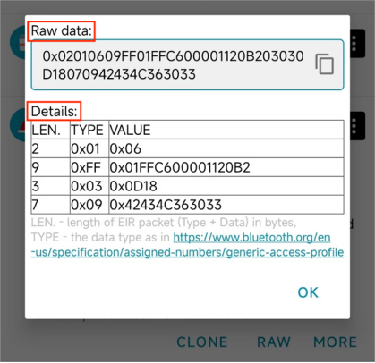
##### 1.1.1 Raw data:
0x代表这串字符串是十六进制的字符串。两位十六进制数代表一个字节。因为两个字符组成的十六进制字符串最大为FF，即255，而Java中byte类型的取值范围是-128到127，刚好可以表示一个255的大小。所以两个十六进制的字符串表示一个字节。  
 继续查看报文内容，开始读取第一个广播数据单元。读取第一个字节:0x02,转换为十进制就是2，即表示后面的2个字节是这个广播数据单元的数据内容。超过这2个字节的数据内容后，表示是一个新的广播数据单元。  
 而第二个广播数据单元，第一个字节的值是0x09,转换为十进制就是9，表示后面9个字节为第二个广播数据单元。  
而第三个广播数据单元，第一个字节的值是0x03,转换为十进制就是3，表示后面3个字节为第三个广播数据单元。  
以此类推。  
在广播数据单元的数据部分中，第一个字节代表数据类型（AD type），决定数据部分表示的是什么数据。（即广播数据单元第二个字节为AD type）
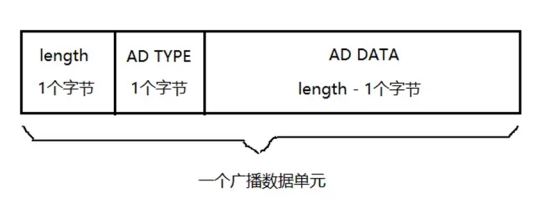
##### 1.1.2 Details:
(1)、Type = 0x01 表示设备LE物理连接。  
(2)、Type = 0xFF 表示厂商数据。前两个字节表示厂商ID,即厂商ID为0xFF01。后面的为厂商数据，具体由用户自行定义  
(3)、Type = 0x03 表示完整的16bit UUID。其值为0x0D18。  
(4)、Type = 0x09 表示设备的全名，例如：0x42434C363033转byte[]再转字符串即为“BCL603” 
#### 1.2 应用
**注：数据传输方式为小端模式**
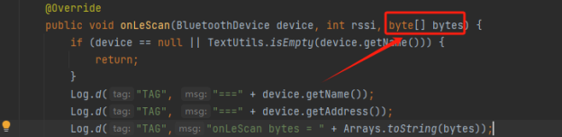
调用蓝牙扫描时找到返回的byte[],这里具体为[2, 1, 6, 9, -1, 1, -1, -58, 0, 0, 17, 32, -78, 3, 3, 13, 24, 7, 9, 66, 67, 76, 54, 48, 51, 0, 0, 0, 0, 0, 0, 0, 0, 0, 0, 0, 0, 0, 0, 0, 0, 0, 0, 0, 0, 0, 0, 0, 0, 0, 0, 0, 0, 0, 0, 0, 0, 0, 0, 0, 0, 0]  
注：byte数据需转换为16进制  
已知该数据的格式和含义，根据规则设置筛选条件为厂商ID == “FF01”即可  
或直接对接收到的数据验证“01FF”（``后续二代广播只需要识别广播中arr[1]为FF即可``）
##### 1.2.1 广播最新版本（二代协议）
检测方法：用manudata里面的固定位置检测``FF``，如 arr[1] = ``FF``   
二代广播和一代广播的不同在于厂商ID"FF01"（小端模式），第1个字节``FF``不变，第0个字节``01``不再固定，表示更多含义  
第0个字节的bit表示：``00000000``   
释意：  
``bit[0:1]``：充电指示位   
``bit[2:3]``：绑定指示位  
``bit[4:7]``：通讯协议版本号  
| 参数名称 | 类型   | 示例值   | 说明                            |
| -------- | ------ | -------- | ------------------------------- |
| 充电指示位    | bit | 1 |1代表未充电 2代表充电中|
| 绑定指示位    | bit | 2 |0不支持绑定、配对(仅软连接) 1绑定和配对 2仅支持配对 |
| 通讯协议版本号    | bit | 0|0:不支持一键获取状态指令的版本<br>1:支持一键获取状态指令的版本 |
 **注：软连接指仅app内连接；<br>绑定和配对指系统层面弹出是否配对选项并且系统蓝牙层面有"！"图标，可以点击；<br>仅配对指系统蓝牙层面没有"!"图标** 
### 2、可能会遇到的问题
资料中带有简单demo，可以先查看简单demo使用SDK的逻辑，再进行自己的开发
#### 2.1 版本相关
Gradle版本。可在gradle-wrapper.properties里修改  
```java
distributionBase=GRADLE_USER_HOME
distributionPath=wrapper/dists
distributionUrl=https\://services.gradle.org/distributions/gradle-8.0-all.zip
zipStoreBase=GRADLE_USER_HOME
zipStorePath=wrapper/dists
```
可在以下网址下载所需版本，将zip放在wrapper/dists对应的路径下（放在随机码文件夹下，记得清空原有内容），重新sync一下  
提供Gradle网站：[Gradle Distributions](https://services.gradle.org/distributions/)
#### 2.2 Gradle 4.0以上导致Xpopup无法使用问题
Xpopup是个第三方弹窗框架，换为普通弹窗可以解决问题
#### 2.3 不需要界面如何使用
ringSDK1.0.2已支持不需要界面，在service做扫描、连接等功能  
**注：后续更新没有专门针对这个开发，如有需要，可以专门更新**
#### 2.4 OTA类引用未找到
可能会出现以下情况：
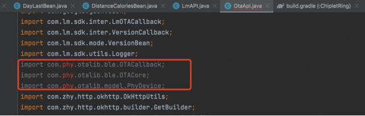
这是官方的其他依赖库，若找不到，可以打开Demo，原始jar包已放到SDK的OTA类文件夹下
### 3、硬件算法逻辑或固件相关
#### 3.1 戒指相关
问：戒指多久存一次数据  
答：可以配置为5，20，30分钟，默认20分钟  
问：OTA升级会清除数据吗  
答：不一定  
问：戒指里的数据可以存几天  
答：最大7天，7天后自动覆盖  
问：恢复出厂设置是只恢复戒指吗  
答：对，只针对戒指硬件进行恢复
#### 3.2 算法相关
问：为什么使用SDK的心率/血氧测量时总显示超时  
答：戒指充电时，无法进行心率血氧测量
#### 3.3 睡眠逻辑图
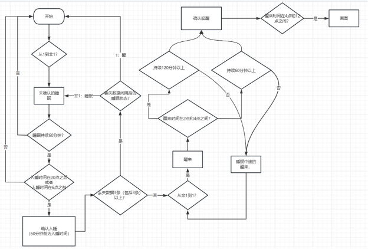
#### 3.4 午睡逻辑图
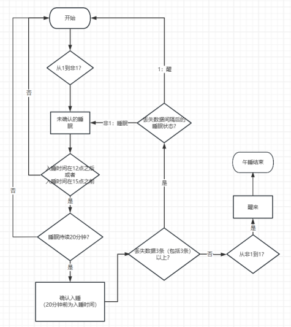
### 4、Q&A
Q：读历史记录过程中，是上报一条标记一条已同步，还是全部上传了整体标记？  
A：一条一条  
Q：采集周期设置有什么限制  
A: 采集周期单位为秒，正常值最小为60s，为0时代表关闭采集。
